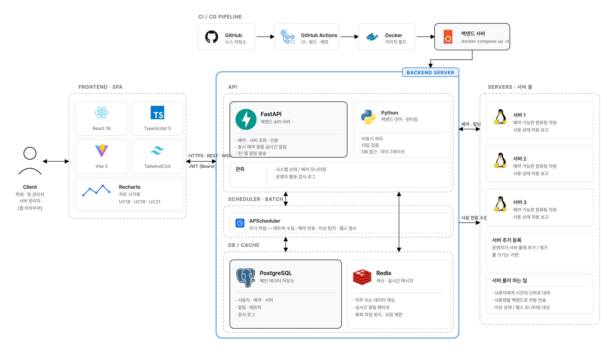
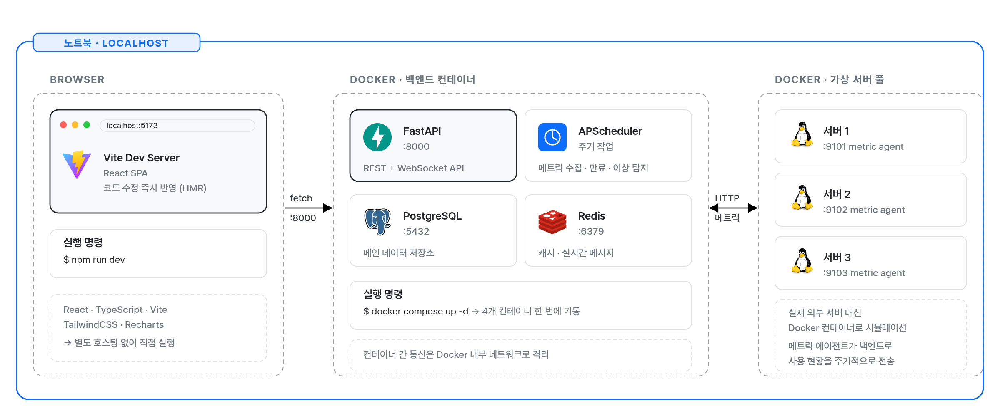

<div align="center">

# 서버 예약 / 할당 관리 시스템

연구실·팀 단위 GPU/서버 공유 시 중복·유휴를 막는 예약·할당·모니터링 플랫폼

[](https://fastapi.tiangolo.com/)
[](https://react.dev/)
[](https://www.postgresql.org/)
[](https://redis.io/)
[](https://www.docker.com/)

</div>

---

## 프로젝트 개요

연구실이나 팀에서 GPU·서버 같은 공용 장비를 여러 명이 나눠 쓸 때 자주 생기는 충돌·유휴·블랙박스 문제를 해소하기 위한 예약·할당·모니터링 시스템입니다. 호텔 예약과 유사한 흐름으로, 학생/연구원은 서버를 예약하고 사용 후 반납하며, 팀 관리자는 Quota 한도를 관리하고, 서버 관리자는 인프라 전반을 운영합니다.

자동화 주체(`SYS`)가 1분 주기로 사용률을 수집하고, 유휴 자원을 자동 회수하며, 이상 징후를 탐지해 AIOps 관점에서 가용성을 예측적으로 관리합니다.

---

## 팀

| 항목 | 내용 |
|------|------|
| 과목 | 한국공학대학교 컴퓨터공학부 · 소프트웨어공학 (01) · 3학년 1학기 |
| 학기 | 2026년 1학기 |
| 팀 | 4조 |
| 팀원 | 김강문 (팀장) · 최민호 · 조동화 |

---

## 기술 스택

| Field | Technology of Use |
|-------|-------------------|
| Frontend |       |
| Backend |       |
| Database |    |
| Scheduler |    |
| DevOps |    |
| Test |     |
| ETC |     |

각 스택의 선정 이유와 제외된 후보(RabbitMQ, Kafka, GraphQL 등)는 [`tech-stacks.html`](./tech-stacks.html) 참조.

---

## 시스템 아키텍처

전체 컴포넌트 구성과 데이터 흐름. CI/CD 파이프라인(GitHub → GitHub Actions → Docker), Frontend SPA, Backend Server (API · Scheduler · DB · Cache), 공유 서버 풀로 구성됩니다.



핵심 흐름:
- Frontend (React SPA) → HTTPS REST · WebSocket → FastAPI (예약·승인·서버 API)
- APScheduler (별도 컨테이너) → 메트릭 수집(UC14) · 유휴 회수(UC15) · 만료 반납(UC16) · 이상 탐지(UC18) · 헬스 점수(UC19)
- PostgreSQL = 메인 데이터 저장소 (사용자·예약·서버·승인·메트릭·감사 로그)
- Redis = 캐시 · 분산 락 · Pub/Sub · Rate limit 카운터

---

## 로컬 런타임 (개발자 노트북)

`docker compose up` 한 번으로 노트북 안에서 전체 스택이 기동되며, 외부 서버 풀(메트릭 수집 대상)과 HTTP로 통신합니다.



- Vite Dev Server (`:5173`) — React SPA + HMR (`npm run dev`)
- FastAPI (`:8000`) — REST + WebSocket API
- APScheduler (별도 컨테이너) — 주기 잡 · 이상 탐지
- PostgreSQL (`:5432`) — 메인 데이터 저장소
- Redis (`:6379`) — 캐시 · 실시간 메시지
- 컨테이너 간 통신은 Docker 내부 네트워크로, 외부 서버 풀(`:9101`)로는 HTTP 메트릭 수집

---

## 저장소 구성

본 레포는 설계 산출물·명세서·다이어그램 전용입니다. 실제 구현은 별도 레포(`backend`, `frontend`, `server-pool`)에서 진행됩니다.

```
diagram-and-docs/
├── README.md                      # 본 파일
├── index.html                     # 설계 문서 색인 (메인 진입점)
├── use-case-spec.html             # UC 21개 풀 명세
├── project-plan.html              # 프로젝트 계획서 (모듈 구성, 일정, 결정)
├── tech-stacks.html               # 기술 스택 채택·제외 근거
├── serverpool-spec.html           # 서버 풀(server-pool) 기능·API 명세
├── docs/
│   ├── erd-feature-api-draft.md       # ERD·기능(30)·API(22) 통합 초안
│   ├── dynamic-models-nfr-draft.md    # 상태도·시퀀스·NFR·ADR 초안
│   ├── test-plan-draft.md             # 테스트 계획 초안
│   ├── notion-page-design.md          # 노션 워크스페이스 설계 스펙
│   └── notion-page-impl-plan.md       # 노션 구현 플랜
└── assets/
    ├── architecture-diagram.png   # 시스템 아키텍처 다이어그램
    ├── runtime-diagram.png        # 노트북 로컬 런타임 다이어그램
    ├── app.js
    └── style.css
```

관련 레포:
- `backend` — FastAPI 서버 + APScheduler (Python)
- `frontend` — React SPA (TypeScript)
- `server-pool` — 모니터링 대상 서버 풀 시뮬레이터 (경량 에이전트 · /health·/metrics)

---

## 주요 문서

| 문서 | 내용 |
|------|------|
| [`index.html`](./index.html) | 설계 문서 색인 (메인 진입점) |
| [`use-case-spec.html`](./use-case-spec.html) | UC 21개 풀 명세 + 부록(가용성 설계, AIOps 연계) |
| [`project-plan.html`](./project-plan.html) | 모듈 분리·UC ↔ 컴포넌트 매핑·핵심 설계 결정·일정 |
| [`tech-stacks.html`](./tech-stacks.html) | 채택 스택 선정 이유 + 제외 후보 검토 |
| [`serverpool-spec.html`](./serverpool-spec.html) | 서버 풀(server-pool) 기능·API 명세 (/health·/metrics 계약) |
| [`docs/erd-feature-api-draft.md`](./docs/erd-feature-api-draft.md) | ERD·기능(30)·API(22) 통합 초안 + 추적 매핑 |
| [`docs/dynamic-models-nfr-draft.md`](./docs/dynamic-models-nfr-draft.md) | 상태도·시퀀스·NFR·ADR 초안 |
| [`docs/test-plan-draft.md`](./docs/test-plan-draft.md) | 테스트 계획 초안 (레벨·동시성·성능·보안) |
| [`docs/notion-page-design.md`](./docs/notion-page-design.md) | 노션 워크스페이스 정보 구조·DB 스키마 |
| [`docs/notion-page-impl-plan.md`](./docs/notion-page-impl-plan.md) | 노션 구현 플랜 (MCP 도구 사용 순서) |

---

## 빠른 시작 (예정)

```bash
# backend (FastAPI + APScheduler)
cd backend
uv sync
docker compose up -d
docker compose exec api alembic upgrade head

# frontend (React SPA, HMR)
cd frontend
npm install
npm run dev
```

---

<div align="center">

한국공학대학교 컴퓨터공학부 · 소프트웨어공학 (01) · 4조 · 2026 1학기

</div>
