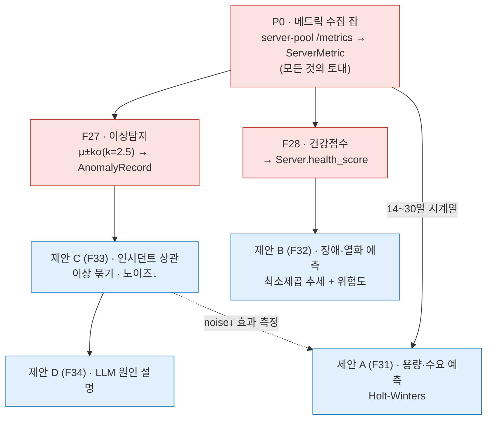
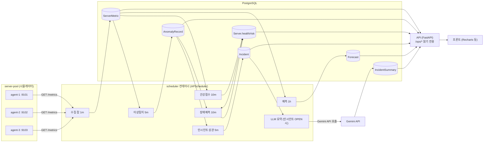

# AIOps 실현 설계 (제안 A·B·C·D를 실제 코드에 얹기)

> 이 문서는 [`ai-ops.md`](./ai-ops.md) 의 제안 4종(F31~F34 / UC22~UC25)을
> **현재 `backend` · `server-pool` 레포의 실제 코드 기준으로** 어떻게 실현할지 정리한 설계서다.
> 모든 경로·필드·잡 이름은 작성 시점의 실제 코드에서 확인했다.
> 데이터 모델 표기는 [`data-model.md`](./data-model.md), 기능 ID는
> [`../02-requirements/features-and-apis.md`](../02-requirements/features-and-apis.md) 와 맞춘다.

---

## 0. 한 줄 결론

**구현 완료 (2026-06-12).** 백엔드 구조(FastAPI + SQLAlchemy 2.0 async + Postgres + APScheduler + Redis,
모델·서비스·잡·API 레이어 분리)에 제안 A·B·C·D와 전제 파이프라인(수집 → 이상탐지 → 건강점수)이
모두 구현·테스트되었다. 구현 순서는 전제 파이프라인(P0·F27·F28) 먼저, 이후 C→A→D→B였다.

---

## 1. 현황 — 문서의 "있음"과 실제 코드의 차이

`ai-ops.md` 0절 표는 F27(이상탐지)·F28(건강점수)을 "있음", F24(유휴 회수)를 "일부"로 적었다.
그러나 실제 `backend/app/` 에는 **모델(스키마)만 있고 그 모델을 채우는 잡(로직)이 없다.**

| 항목 | 모델 | 잡(로직) | 실제 상태 (근거) |
|------|------|----------|------------------|
| 메트릭 수집 (server-pool `/metrics` → `ServerMetric`) | 있음 (`models/server_metric.py`) | **없음** | `config.py:30-31` 에 `serverpool_host/base_port` 만, 주석 "수집 구현은 후속 단계". `app/jobs/` 에 수집 잡 없음 |
| 이상탐지 F27 (μ±2σ → `AnomalyRecord`) | 있음 (`models/anomaly_record.py`) | **없음** | `jobs/` 엔 `reservation_jobs.py`·`approval_jobs.py` 둘뿐 |
| 건강점수 F28 (`Server.health_score`) | 컬럼 있음 (`models/server.py`) | **없음** | 주석 "health_score는 스케줄러가 메트릭으로 산출한다(후속)". 항상 `null` |
| 유휴 회수 F24 (`RECLAIMED`) | enum 있음 (`enums.py`) | **없음** | 전이 잡 없음 |
| 별도 스케줄러 컨테이너 | — | **비어 있음** | `app/scheduler.py` 가 잡을 하나도 `add_job` 하지 않음. 현재 동작 잡은 `main.py` lifespan 의 2개뿐 |

> 현재 (2026-06-12): 위 표의 모든 항목이 구현 완료되었다. 메트릭 수집·F27·F28 잡이 스케줄러에 등록되어 동작 중이며, 두 스키마 갭(AnomalyRecord.metric, incident_id)은 각각 0003·0004 마이그레이션으로 해결되었다.

### 추가로 발견한 스키마 갭
- `AnomalyRecord` 에 **어떤 메트릭(cpu/mem/net/gpu)인지** 구분하는 필드가 없다
  → 제안 C(유형별 묶기)·D(원인 컨텍스트)에 필요. **`metric` 컬럼 추가 필요.**
- `AnomalyRecord.incident_id` FK 가 없다 → 제안 C 에 필요. **추가 필요.**
- `Notification.type` 은 평문 `String(50)` (`enums.py` 주석: "확정되면 Enum 추가")
  → 신규 타입(CAPACITY·PREDICTIVE_FAILURE·INCIDENT)은 값만 추가하면 되어 **부담 없음.**

---

## 2. 의존성 사다리 (왜 순서가 중요한가)

제안 A·B·C·D 는 모두 "수집된 데이터" 위에서 동작한다. 전제가 빠지면 빈 테이블을 보게 된다.



붉은색(P0·F27·F28)이 현재 0% 구현 상태의 **전제**, 파란색이 제안 본체다.
`ai-ops.md` 의 권장 순서(C→A→D→B)는 전제가 깔린 다음에야 의미가 있다.

### 권장 빌드 순서 (전제 포함)
1. **Phase 0** — 메트릭 수집 잡 (P0)
2. **Phase 1** — F27 이상탐지 + F28 건강점수 (전제 완성)
3. **Phase 2** — 제안 C (인시던트 상관 · 즉시 수치 어필)
4. **Phase 3** — 제안 A (용량 예측 · "데이터로 똑똑해짐" 스토리)
5. **Phase 4** — 제안 D (LLM 설명 · C 위에 얹음 · 데모 임팩트)
6. **Phase 5** — 제안 B (장애 예측 · 라벨 쌓이면 학습형 승급)

---

## 3. 전체 아키텍처

### 3-1. 연산 위치 — API 컨테이너 vs 스케줄러 컨테이너

`ai-ops.md` 공통 전제: "모든 AI 로직은 APScheduler 잡(별도 컨테이너)에서 돌고, API는 저장된
결과 조회만 한다." 현재 코드 상태와 합치면:

- **무거운 잡(pandas·statsmodels·LLM 호출)은 전부 스케줄러 컨테이너(`app/scheduler.py`)에서
  돈다.** 잡 등록은 `app/jobs/scheduling.py` 의 `register_jobs()` 한 곳에 모았고, `scheduler.py`
  가 이를 호출한다.
- **API 라우터(`app/api/ops.py` 등)는 DB에 저장된 결과만 읽는다.** 무거운 라이브러리를 API
  프로세스에 올리지 않아 응답이 가볍다.
- **잡 단일 소유(구현 완료):** 예약·승인 전이 잡까지 모두 `register_jobs()` 로 이전해, API
  프로세스(`main.py`)는 잡을 등록·실행하지 않는다. 스케줄러·API 컨테이너가 동시에 떠도
  잡이 **이중 실행되지 않는다**(초안의 lifespan 이중 실행 위험은 해소됨).

### 3-2. 데이터 흐름



---

## 4. Phase 0 — 메트릭 수집 잡 (P0, 모든 것의 토대)

### 4-1. 목적
server-pool 에이전트들의 `GET /metrics` 를 주기적으로 **풀(pull)** 해 `ServerMetric` 에 적재한다.
이게 없으면 이상탐지·건강점수·예측 모두 빈 테이블이다.

### 4-2. server-pool 계약 (확인됨)
`server-pool/agent/main.py` 의 `GET /metrics` 응답:
```json
{ "serverId": 1, "collectedAt": "2026-06-12T09:00:00Z",
  "cpuUsage": 37.5, "memUsage": 61.2, "gpuUsage": 88.0, "netUsage": 12.4, "status": "OK" }
```
- 에이전트는 응답하는 한 항상 `status: "OK"`. `gpuUsage` 는 GPU 미시뮬 시 `null`.
- 포트 규약: `agent-N` = `serverpool_base_port + (N-1)` (예: server_id=1 → 9101).

### 4-3. 서버 ↔ 에이전트 엔드포인트 매핑 (결정 필요)
현재 `config.py` 는 단일 호스트 + 베이스 포트만 안다. 두 안 중 택1:
- **(MVP) 규약 매핑:** `http://{serverpool_host}:{base_port + (server_id-1)}/metrics`.
  서버 id 가 에이전트 번호와 1:1일 때 간단. 시뮬 환경에 적합.
- **(확장) 서버별 엔드포인트 저장:** `Server.ip`(이미 존재) 또는 신규 `metrics_endpoint`
  컬럼에 에이전트 주소를 저장. 실서버 확장 시 권장.
> 본 설계는 MVP 규약 매핑을 기본으로 한다(주석으로 확장 포인트 표시).

### 4-4. 잡 로직 — `app/jobs/metric_collection_job.py` (신규)
기존 잡 컨벤션(`reservation_jobs.py`: `async with SessionLocal()` + try/commit/except/rollback)을 따른다.
```python
# 의사코드 (실제 컨벤션 기준)
async def collect_server_metrics() -> None:
    timeout = httpx.Timeout(3.0)
    async with SessionLocal() as db, httpx.AsyncClient(timeout=timeout) as http:
        servers = await db.scalars(
            select(Server).where(Server.deleted_at.is_(None))
        )
        for s in servers:
            port = settings.serverpool_base_port + (s.id - 1)
            url = f"http://{settings.serverpool_host}:{port}/metrics"
            try:
                r = await http.get(url)
                r.raise_for_status()
                d = r.json()
                db.add(ServerMetric(
                    server_id=s.id,
                    cpu_usage=d["cpuUsage"], mem_usage=d["memUsage"],
                    net_usage=d["netUsage"],
                    gpu_usage=d.get("gpuUsage"),          # GPU 미탑재면 null 그대로 저장
                    status="OK",                          # 응답 성공이면 OK
                ))
            except (httpx.HTTPError, KeyError, ValueError):
                # 무응답·계약 위반 → MISSING 으로 기록 (수집 품질을 데이터로 남김)
                db.add(ServerMetric(
                    server_id=s.id, cpu_usage=0, mem_usage=0, net_usage=0,
                    gpu_usage=None, status="MISSING"))
        await db.commit()
```
> 실제 구현은 URL 조립·payload 파싱을 순수 모듈(`services/metric_ingest.py`)로 분리하고,
> 잡(`jobs/metric_collection_job.py`)은 HTTP 호출·기록만 한다. 세션 팩토리·httpx 클라이언트는
> 테스트를 위해 인자로 주입받는다(`collected_at` 은 DB `server_default` 로 채운다).
- **주기:** 데모 5초(설계 1분). `scheduling.py` 의 `id="metric_collection"`.
- **품질 판정:** 응답 성공 → `OK`(GPU 미탑재면 `gpu_usage` 만 null), 무응답·계약 위반 →
  `MetricStatus.MISSING`. 즉 `NA` 가 아니라 OK + null gpu 로 표현한다.
- **전제 데이터:** `Server` 행이 에이전트 id 와 맞게 시드되어야 함(시드 스크립트 필요).

### 4-5. 의존성
- `httpx` 를 **런타임 의존성**으로 승격(현재 dev 전용). 수집 잡이 쓴다.

---

## 5. Phase 1 — 전제 완성 (F27 이상탐지 + F28 건강점수)

### 5-1. F27 이상탐지 — `app/jobs/anomaly_detection_job.py` (신규)

#### 스키마 변경 (마이그레이션 필요)
`AnomalyRecord` 에 메트릭 종류 컬럼 추가:
```python
# models/anomaly_record.py 에 추가
metric: Mapped[str] = mapped_column(String(10))   # CPU|MEM|NET|GPU
incident_id: Mapped[int | None] = mapped_column(  # 제안 C 에서 채움
    BigInteger, ForeignKey("incident.id"), nullable=True)
```
`enums.py` 에 `class MetricType(str, Enum): CPU/MEM/NET/GPU` 추가.
> 참고: `metric` 컬럼은 0003 마이그레이션에서 추가되었고, `incident_id` FK는 0004(제안 C)에서 추가되었다. 0003에서 함께 추가된 것이 아님에 유의.

#### 로직
> 실제 구현은 판정 로직을 순수 모듈(`services/anomaly.py`의 `evaluate_anomaly`)로 분리하고,
> 잡(`jobs/anomaly_detection_job.py`)은 시계열 조회·디바운스·기록만 한다. 통계는 numpy 대신
> 표준 라이브러리 `statistics`(`fmean`·`pstdev`, 모표준편차)를 쓴다.
```python
# services/anomaly.py (순수 로직)
MIN_SAMPLES = 30      # 기준선 신뢰 최소 표본
_MIN_SIGMA = 8.0      # 판정용 σ 절대 하한(안정 구간 좁은 밴드 오탐 방지)

def evaluate_anomaly(history, latest, *, min_samples=MIN_SAMPLES, k=2.5):
    if len(history) < min_samples:
        return AnomalyDecision(False, 0.0, 0.0)     # 표본 부족 → 비이상
    mu, sigma = fmean(history), pstdev(history)
    if sigma <= 0:
        return AnomalyDecision(False, mu, sigma)    # 분산 0 → 단정 불가
    band_sigma = max(sigma, _MIN_SIGMA)             # σ 하한 적용
    return AnomalyDecision(abs(latest - mu) > k * band_sigma, mu, sigma)
```
```python
# jobs/anomaly_detection_job.py (DB·기록)
async def detect_anomalies(*, session_factory=SessionLocal) -> None:
    async with session_factory() as db:
        for s in await _active_servers(db):           # deleted_at IS NULL
            for metric in ("CPU", "MEM", "NET", "GPU"):
                vals = await _recent_ok_values(db, s.id, metric, window="7d")
                if len(vals) < MIN_SAMPLES + 1:       # 최신값 1개 + 기준선 30개
                    continue
                latest, history = vals[0], vals[1:]   # 최신순 정렬 → 맨 앞이 최신
                decision = evaluate_anomaly(history, latest)
                if decision.is_anomaly and not await _recently_recorded(db, s.id, metric, "1h"):
                    db.add(AnomalyRecord(server_id=s.id, metric=metric,
                           current_value=latest, mean=decision.mean, stddev=decision.stddev))
        await db.commit()
```
- **주기:** 데모 5초(설계 1분). `scheduling.py` 의 `id="anomaly_detection"`.
- **판정:** μ±kσ, **k=2.5**. 판정용 σ 에는 절대 하한 `_MIN_SIGMA=8.0` 을 둔다 — 매우 안정적인
  구간은 σ 가 0 에 가까워 밴드가 면도날처럼 좁아져, 평소 잔떨림(GPU 합성값 ±5 등)조차 이상으로
  오탐한다. 하한 덕에 **유휴·안정 서버 풀이 초기에 헛이상을 내지 않는다.** 기록되는 `stddev` 는
  실제 σ 그대로(분석용).
- **표본:** 30개 미만이거나 σ 가 0 이면 항상 비이상으로 본다.
- **디바운스:** 같은 서버·메트릭은 **1시간** 내 1회만 기록 → 폭주 방지.

### 5-2. F28 건강점수 — `app/jobs/health_score_job.py` (신규)
```python
async def compute_health_scores() -> None:
    async with SessionLocal() as db:
        for s in await _active_servers(db):
            m = await _latest_metric(db, s.id)
            anom = await _anomaly_count(db, s.id, "24h")
            miss = await _missing_rate(db, s.id, "1h")
            score = 100
            score -= _usage_penalty(m)        # 고사용률 감점(cpu/mem/gpu)
            score -= min(30, anom * 3)        # 이상 빈도 감점
            score -= int(miss * 20)           # 수집 누락 감점
            await _set_health_score(db, s.id, max(0, score))
        await db.commit()
```
- **주기:** 10분.
- ⚠️ **낙관적 락 주의:** `Server` 에는 `version`(낙관적 락)이 있고 예약 흐름이 이를 쓴다
  (`reservation_service.py`). 건강점수를 ORM 으로 갱신하며 `version` 을 올리면 동시 예약
  갱신과 **불필요한 충돌**이 난다. `_set_health_score` 는 `version` 을 건드리지 않는
  **직접 UPDATE**(`UPDATE server SET health_score=:v WHERE id=:id`)로 구현한다.
  (또는 `health_score`·`risk_score` 를 별도 `ServerHealth` 테이블로 분리하는 안도 가능 —
  본 설계는 컬럼 유지 + 직접 UPDATE 를 기본으로 한다.)
- **효과:** `create_instant_reservation` 이 이미 `health_score` 로 정렬한다
  (`reservation_service.py:78-82`) → 이 잡이 그 정렬을 비로소 "살아 있게" 만든다.

---

## 6. Phase 2 — 제안 C (F33/UC24) 이상 상관 · 노이즈 감소

### 6-1. 신규 엔티티 — `app/models/incident.py`
```python
class Incident(Base):
    __tablename__ = "incident"
    id: Mapped[int] = mapped_column(BigInteger, primary_key=True, autoincrement=True)
    severity: Mapped[str] = mapped_column(String(10))   # INFO|WARNING|CRITICAL
    status: Mapped[str] = mapped_column(String(10), default="OPEN")  # OPEN|RESOLVED
    anomaly_count: Mapped[int] = mapped_column(Integer, default=0)
    server_ids: Mapped[dict] = mapped_column(JSONB)     # 연관 서버 목록
    started_at: Mapped[datetime] = mapped_column(DateTime(timezone=True), server_default=func.now())
    resolved_at: Mapped[datetime | None] = mapped_column(DateTime(timezone=True), nullable=True)
```
`AnomalyRecord.incident_id` FK 는 5-1 에서 이미 추가.

### 6-2. 잡 — `app/jobs/incident_correlation_job.py` (신규)
```python
async def correlate_anomalies() -> None:
    async with SessionLocal() as db:
        # 1) 미할당 이상(incident_id IS NULL)을 서버그룹 + 10분 윈도우로 모음
        groups = await _group_unassigned(db, window="10m")
        for g in groups:
            inc = await _find_open_incident(db, g.group_name) \
                  or Incident(severity="INFO", status="OPEN",
                              server_ids=[], anomaly_count=0)
            _attach(inc, g.anomalies)                 # incident_id 채움
            inc.anomaly_count += len(g.anomalies)
            inc.severity = _severity(inc)             # 이상수·서버수·최고편차
            db.add(inc)
            if inc.status == "OPEN" and _is_new(inc):
                await _notify_once(db, inc)           # Notification(type=INCIDENT) 1건
        # 2) 15분간 새 이상 없는 OPEN → RESOLVED 자동 종료
        await _auto_resolve(db, idle="15m")
        await db.commit()
```
- **주기:** 5분(F27 직후).
- **디바운스/상태관리:** OPEN 인시던트는 DB 조회로 추적. Redis 키(`incident:open:{group}`)는
  선택적 고도화(이미 `core/redis.py` 존재).
- **노이즈 감소율:** `noiseReductionRate = 1 - 인시던트수/이상수` 를 API·대시보드에 노출.

### 6-3. API — `app/api/ops.py` (신규 라우터)
```python
router = APIRouter(prefix="/ops", tags=["ops"])

@router.get("/incidents")
async def list_incidents(status: str | None = None, severity: str | None = None,
        user: User = Depends(require_role("MGR", "ADM")),
        db: AsyncSession = Depends(get_db)): ...

@router.get("/incidents/{id}")     # 묶인 AnomalyRecord 목록 반환
```
- **권한:** 전부 `require_role("MGR","ADM")` (`core/deps.py:44` 패턴).
- `main.py` 에 `app.include_router(ops.router)` 등록.

### 6-4. 프론트
- 알림함을 개별 이상이 아닌 **인시던트 타임라인(접힌 그룹)** 으로, "관련 이상 12건" 펼치기.
- 대시보드 **"노이즈 감소율 86%"** KPI 카드.

---

## 7. Phase 3 — 제안 A (F31/UC22) 용량·수요 예측

### 7-1. 신규 엔티티 — `app/models/forecast.py`
```python
class Forecast(Base):
    __tablename__ = "forecast"
    id: Mapped[int] = mapped_column(BigInteger, primary_key=True, autoincrement=True)
    server_id: Mapped[int | None] = mapped_column(BigInteger, ForeignKey("server.id"), nullable=True)
    metric: Mapped[str] = mapped_column(String(20))   # CPU|MEM|GPU|RESERVATION_DEMAND
    horizon: Mapped[dict] = mapped_column(JSONB)       # [{ts,yhat,lower,upper}]
    saturation_at: Mapped[datetime | None] = mapped_column(DateTime(timezone=True), nullable=True)
    confidence: Mapped[float] = mapped_column(Float)
    generated_at: Mapped[datetime] = mapped_column(DateTime(timezone=True), server_default=func.now())
```

### 7-2. 잡 — `app/jobs/forecast_job.py` (신규)
```python
async def generate_forecasts() -> None:
    async with SessionLocal() as db:
        for s in await _active_servers(db):
            for metric in ("CPU", "MEM", "GPU"):
                raw = await _series(db, s.id, metric, days=30)     # ServerMetric
                ser = (pd.DataFrame(raw).set_index("ts")["v"]
                         .resample("1h").mean().interpolate())      # 1분→1시간, 결측 보간
                if len(ser) < 168:                                  # 표본 부족
                    continue
                fit = ExponentialSmoothing(ser, trend="add",
                        seasonal="add", seasonal_periods=24).fit()  # Holt-Winters
                fc = fit.forecast(168)                              # 7일
                band = 1.96 * np.std(fit.resid)
                sat = _first_cross(fc, threshold=90)                # 포화 예상 시각
                db.add(Forecast(server_id=s.id, metric=metric,
                       horizon=_to_points(fc, band), saturation_at=sat,
                       confidence=_conf(fit)))
                if sat and (sat - now) < timedelta(hours=72):
                    await _notify(db, type="CAPACITY", ...)
        # 예약 수요: Reservation.created_at 추이로 동일 예측 (server_id=None)
        await db.commit()
```
- **주기:** 1시간.
- **라이브러리:** **pandas·numpy·statsmodels 추가 필요.** MVP 는 Holt-Winters
  (`statsmodels.ExponentialSmoothing`)로 충분. 강화 시 SARIMA/prophet.
- **모델:** 수준·추세·계절 3성분 지수평활. 매 실행 최신 윈도우로 재적합 → "데이터 쌓이며 정확".

### 7-3. API — `GET /ops/forecast`  (`?serverId&metric&days`)
`ops.py` 에 추가. 404 = 데이터 부족(예측 불가).

### 7-4. 프론트
- Recharts 라인: **실측선(실선) + 예측선(점선) + 신뢰구간 밴드(반투명)**.
- 서버 카드 **"포화 예상: 2일 14시간 후"** 경고 배지.

---

## 8. Phase 4 — 제안 D (F34/UC25) LLM 원인 설명·요약

### 8-1. 신규 엔티티 — `app/models/incident_summary.py`
```python
class IncidentSummary(Base):
    __tablename__ = "incident_summary"
    id: Mapped[int] = mapped_column(BigInteger, primary_key=True, autoincrement=True)
    incident_id: Mapped[int] = mapped_column(BigInteger, ForeignKey("incident.id"))
    situation: Mapped[str] = mapped_column(String)
    root_causes: Mapped[dict] = mapped_column(JSONB)       # [{cause, evidence}]
    recommendations: Mapped[dict] = mapped_column(JSONB)   # [{action, rationale}]
    model: Mapped[str] = mapped_column(String(100))
    generated_at: Mapped[datetime] = mapped_column(DateTime(timezone=True), server_default=func.now())
```

### 8-2. 잡/서비스 — `app/jobs/incident_summary_job.py` + `app/services/incident_summary.py`

> 실제 구현 모듈: `app/services/incident_summary.py`(컨텍스트 구성·프롬프트·파싱)와 `app/jobs/incident_summary_job.py`(배치 잡 `summarize_pending_incidents`, 데모 10초/설계 5분 주기로 요약 없는 OPEN 인시던트를 폴링). 인시던트당 1회만 생성하고, `settings.gemini_api_key` 가 없으면 잡 시작에서 조용히 건너뛴다. 초안에서 언급한 `llm_service.py` 이름은 실제 코드와 다르다. 아래 의사코드는 인시던트 1건 처리 흐름을 보인 것이다.
```python
async def summarize_incident(incident_id) -> None:
    async with SessionLocal() as db:
        ctx = await _build_context(db, incident_id)   # 묶인 이상 + 해당 시점 메트릭 + 서버 메타
        response = await client.aio.models.generate_content(
            model=settings.gemini_model,
            contents=_prompt(ctx),
            config={"max_output_tokens": 1024})
        parsed = _parse(response.text)  # 상황/원인후보/권장조치 + 근거 인용
        db.add(IncidentSummary(incident_id=incident_id, **parsed,
               model=settings.gemini_model))
        await db.commit()
```
- **트리거:** 인시던트가 `OPEN` 생성될 때(제안 C 잡 내부) 또는 운영자가 상세를 열 때.
- **프롬프트 원칙:** "①상황 ②원인 후보 ③권장 조치를 한국어로. 각 주장 뒤에 근거 데이터
  (서버/시각/값)를 괄호 인용. 데이터에 없으면 추측 금지." → 환각 억제.
- **안전장치:** LLM 은 **읽기 전용 분석만**, 자동 조치 금지(사람이 최종 판단).
- **비용:** 인시던트당 1회 생성 후 `IncidentSummary` 저장(재조회는 DB). Redis 단기 캐시 선택.

### 8-3. 의존성·설정 (보안)
- `google-genai` SDK 추가.
- `config.py` 에 `gemini_api_key`(환경변수), `gemini_model` 추가.
  **키는 절대 하드코딩 금지** — `.env`/환경변수로만. 시작 시 존재 검증.

### 8-4. API · 프론트
- `GET /ops/incidents/{id}/summary` (404 = 요약 미생성).
- 인시던트 상세에 **"AI 분석 요약"** 카드(상황/원인/권장 + 근거 토글) + "AI 작성, 사람 검토 필요" 라벨.

---

## 9. Phase 5 — 제안 B (F32/UC23) 장애·건강 열화 예측

### 9-1. 스키마 변경 (마이그레이션) — `Server` 확장
```python
# models/server.py 에 추가
risk_score: Mapped[float | None] = mapped_column(Float, nullable=True)        # 0~100
eta_to_risk: Mapped[datetime | None] = mapped_column(DateTime(timezone=True), nullable=True)
```
> 5-2 와 동일한 낙관적 락 주의 — `version` 안 건드리는 직접 UPDATE 로 갱신.
> 건강점수 시계열이 필요하므로 `health_score` 이력 보관용 경량 테이블
> (`server_health_history(server_id, score, ts)`) 추가를 권장(추세 기울기 계산용).

### 9-2. 잡 — `app/jobs/failure_prediction_job.py` (신규)
```python
async def predict_failures() -> None:
    async with SessionLocal() as db:
        for s in await _active_servers(db):
            slope = _ewma_slope(await _health_history(db, s.id, days=7))  # 점수 하락 기울기
            freq = await _anomaly_count(db, s.id, "24h")                  # 이상 빈도
            risk = _w1*max(0,-slope) + _w2*freq + _w3*(100 - (s.health_score or 100))
            risk = min(100, risk)
            eta = _extrapolate(slope, s.health_score)                     # 위험 진입 예상 시각
            await _set_risk(db, s.id, risk, eta)                          # version 미변경 UPDATE
            if risk >= _RISK_THRESHOLD:
                await _notify(db, type="PREDICTIVE_FAILURE", ...)
                await _suggest_maintenance(db, s.id)   # MaintenanceSchedule 제안
        await db.commit()
```
- **주기:** 10분(F28 직후).
- **MVP:** 규칙 기반 점수화. 라벨(실제 회수/장애)이 쌓이면 로지스틱 회귀로 승급.
- **재활용:** `MaintenanceSchedule` 모델 이미 존재 → 점검창 제안에 사용.

### 9-3. API · 프론트
- `GET /servers/{id}/health-trend` (riskScore·trend·etaToRisk·history·drivers).
  → `reservations` 가 아닌 servers 도메인이므로 `app/api/servers.py`(신규) 또는 `ops.py`.
- 서버 카드 **위험 예측 배지** + 건강점수 **스파크라인**, 위험 서버 대시보드 상단 정렬.

---

## 10. 스키마 변경 총정리 (마이그레이션 목록)

| # | 마이그레이션 | 대상 | 변경 |
|---|--------------|------|------|
| 0003 | `add_anomaly_metric_and_incident_fk` | `anomaly_record` | `metric` 컬럼, `incident_id` FK(nullable) 추가 |
| 0004 | `add_incident` | 신규 `incident` | 테이블 생성 |
| 0005 | `add_forecast` | 신규 `forecast` | 테이블 생성 |
| 0006 | `add_incident_summary` | 신규 `incident_summary` | 테이블 생성 |
| 0007 | `add_server_risk_fields` | `server` | `risk_score`·`eta_to_risk` 추가 |
| 0008 | `add_server_health_history` | 신규 `server_health_history` | (제안 B 추세용, 선택) |

생성·적용은 기존 방식 그대로:
```bash
alembic revision --autogenerate -m "add_incident"
alembic upgrade head
```

> 최종 마이그레이션 체인 (구현 완료 순서):
> 0003(anomaly.metric) → 0004(incident 테이블 + anomaly.incident_id) → 0005(forecast) → 0006(incident_summary) → 0007(server risk 필드 + server_health_history)
(`alembic/env.py` 가 `import app.models` 로 메타데이터를 잡으므로 신규 모델은
`app/models/__init__.py` 에 등록만 하면 자동 감지된다.)

---

## 11. 의존성 추가 & 컨테이너 영향

| 라이브러리 | 쓰는 곳 | Phase | 비고 |
|------------|---------|-------|------|
| `httpx` (런타임 승격) | 수집 잡 | 0 | 현재 dev 전용 |
| `numpy` | 이상탐지·예측·위험도 | 1·3·5 | |
| `pandas` | 예측(리샘플·보간) | 3 | |
| `statsmodels` | Holt-Winters | 3 | MVP. 강화 시 prophet/SARIMA |
| `google-genai` | LLM 요약 | 4 | API 키 환경변수 필수 |

> **컨테이너 분리 효과:** 무거운 라이브러리(pandas·statsmodels·google-genai)는 **스케줄러
> 컨테이너만** 필요하다. API 컨테이너는 `/ops/*` 읽기 전용이라 추가 의존성이 거의 없다.
> `pyproject.toml` 의 optional-dependencies 그룹(`[aiops]`)으로 분리해 API 이미지를
> 가볍게 유지하는 것을 권장.

---

## 12. 스케줄러 등록 (cadence 한눈에)

모든 잡은 `app/jobs/scheduling.py` 의 `register_jobs()` 한 곳에 등록되고, 스케줄러
컨테이너(`app/scheduler.py`)가 이를 호출해 잡을 단독 소유한다(API 프로세스는 잡을 돌리지
않아 이중 실행을 막는다). 주기는 **로컬 데모용으로 가속한 초 단위**다(괄호 안은 설계 주기).
이 표는 `scheduling.py` 와 정확히 일치한다.

| 잡 id | 함수 | 주기(데모/설계) | Phase / ID |
|----|------|------|------------|
| `reservation_transitions` | `process_reservation_transitions` | 5초 / 1분 | (UC16) |
| `approval_timeout` | `auto_reject_timed_out_requests` | 5초 / 1분 | (UC17) |
| `metric_collection` | `collect_server_metrics` | 5초 / 1분 | 0 (P0) |
| `anomaly_detection` | `detect_anomalies` | 5초 / 1분 | 1 (F27) |
| `health_score` | `compute_health_scores` | 10초 / 10분 | 1 (F28) |
| `incident_correlation` | `correlate_anomalies` | 5초 / 5분 | 2 (F33) |
| `forecast` | `generate_forecasts` | 30초 / 1시간 | 3 (F31) |
| `incident_summary` | `summarize_pending_incidents` | 10초 / 5분 | 4 (F34) |
| `failure_prediction` | `predict_failures` | 15초 / 10분 | 5 (F32) |
| `idle_reclaim` | `reclaim_idle_servers` | 5초 / 1분 | (F24/UC15) |
| `maintenance_transition` | `transition_maintenance_schedules` | 5초 / 1분 | (F30/UC13) |

> 3-1 의 "잡을 한 곳으로 모으는 정리" 권고는 구현 완료되었다. 예약·승인 전이 잡도
> `register_jobs()` 로 이전되어 **잡 단일 소유**가 확립되었다(LLM 요약은 별도 트리거가 아니라
> OPEN 인시던트를 폴링하는 주기 잡으로 구현됨).

### Notification.type 확장 (`enums.py`)
신규 값만 추가(평문 문자열이라 마이그레이션 불필요):
`CAPACITY`(제안 A), `INCIDENT`(제안 C), `PREDICTIVE_FAILURE`(제안 B).

---

## 13. 리스크 & 완화

| 리스크 | 영향 | 완화 |
|--------|------|------|
| 전제 파이프라인 미구현 | 제안 전부 빈 데이터 | **Phase 0·1 먼저** (본 설계의 핵심) |
| 데이터 부족(학기 단위) → 계절성·예측 품질 | A·B 정확도 낮음 | 표본 임계(예측 168h↑, 이상 30↑) 미달 시 건너뜀·신뢰도 표기 |
| 건강점수 갱신이 낙관적 락과 충돌 | 예약 갱신 오류 | `version` 미변경 직접 UPDATE / 별도 테이블 |
| 스케줄러·API 잡 이중 실행 | 중복 알림·부하 | 잡을 `scheduler.py` 단일 소유로 통합 |
| LLM 비용·환각 | 비용·오정보 | 인시던트당 1회 캐시, 근거 인용 강제, 읽기 전용·사람 검토 |
| API 키 노출 | 보안 사고 | 환경변수만, 하드코딩 금지, 시작 시 검증 |
| 무거운 라이브러리로 이미지 비대 | 배포 지연 | optional 의존성 그룹으로 API/스케줄러 분리 |

---

## 14. 구현 체크리스트 (추적용)

완료 — **Phase 0** ☑ `httpx` 런타임 승격 ☑ `metric_collection_job.py` ☑ 서버 시드 ☑ scheduler 등록(1m)
완료 — **Phase 1** ☑ 0003 마이그레이션(metric/incident_id) ☑ `MetricType` enum ☑ `anomaly_detection_job.py`(5m) ☑ `health_score_job.py`(10m, version-safe UPDATE)
완료 — **Phase 2 (C)** ☑ `Incident` 모델 + 0004 ☑ `incident_correlation_job.py`(5m) ☑ `ops.py` 라우터 + include ☑ noiseReductionRate ☑ 프론트 타임라인/KPI
완료 — **Phase 3 (A)** ☑ pandas/numpy/statsmodels ☑ `Forecast` 모델 + 0005 ☑ `forecast_job.py`(1h) ☑ `GET /ops/forecast` ☑ 프론트 예측 차트
완료 — **Phase 4 (D)** ☑ `google-genai` + API키 설정 ☑ `IncidentSummary` 모델 + 0006 ☑ `incident_summary.py`/요약 잡 ☑ `GET /ops/incidents/{id}/summary` ☑ 프론트 AI 카드
완료 — **Phase 5 (B)** ☑ `Server` risk 필드 + 0007 ☑ health history(선택) 0008 ☑ `failure_prediction_job.py`(10m) ☑ `GET /servers/{id}/health-trend` ☑ 프론트 위험 배지

---

## 15. 부록 — 신규 항목 (추적 매핑)

| 신규 ID | 기능 | 전제 | 신규 엔티티 | 신규 잡 | API |
|---------|------|------|-------------|---------|-----|
| (P0) | 메트릭 수집 | — | — | `metric_collection_job` | — |
| (F27) | 이상탐지 | P0 | `AnomalyRecord.metric` | `anomaly_detection_job` | — |
| (F28) | 건강점수 | P0 | — | `health_score_job` | — |
| F33 | 인시던트 상관 | F27 | `Incident` | `incident_correlation_job` | `GET /ops/incidents[/{id}]` |
| F31 | 용량 예측 | P0 | `Forecast` | `forecast_job` | `GET /ops/forecast` |
| F34 | LLM 설명 | F33 | `IncidentSummary` | `incident_summary_job` | `GET /ops/incidents/{id}/summary` |
| F32 | 장애 예측 | F28 | `Server` 확장 | `failure_prediction_job` | `GET /servers/{id}/health-trend` |
