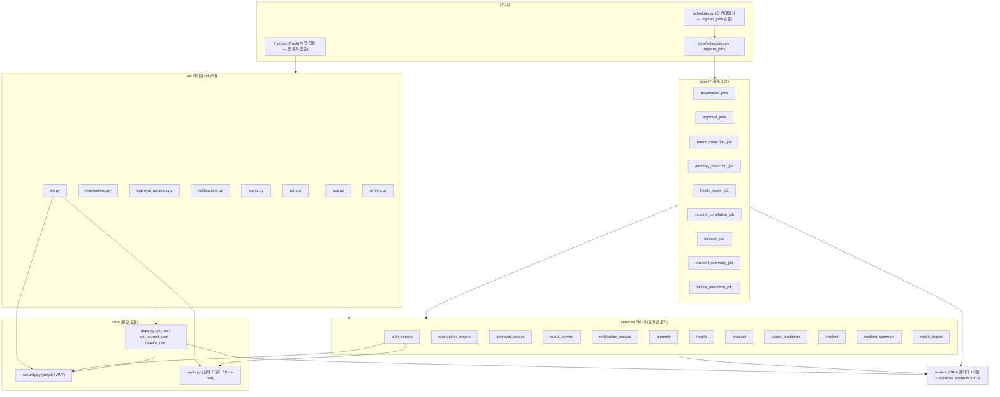
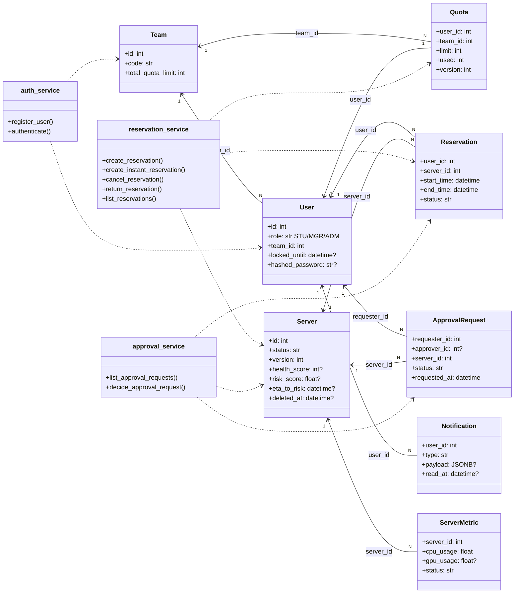

# 백엔드 상세설계 — 클래스 구조 · SOLID · 디자인 패턴

본 문서는 `backend` 레포(FastAPI 기반 서버 예약·할당 관리 시스템)의 실제 코드를 기준으로
레이어 구조, 클래스(모듈) 관계, SOLID 원칙 적용, 디자인 패턴, 핵심 알고리즘을 정리한다.
모든 코드 발췌는 작성 시점의 `backend` 레포 파일에서 직접 인용했다.

최신화 2026-06-12 (AIOps 구현 반영)

---

## 1. 레이어 구조

백엔드는 **api(라우터) → services(도메인 로직) → models(ORM)** 3계층 구조에,
모든 계층이 공유하는 횡단(cross-cutting) 모듈 **core** 를 더한 형태다.
의존 방향은 항상 위에서 아래로 단방향이며, 하위 계층은 상위 계층을 알지 못한다.

| 레이어 | 위치 | 책임 | 의존 대상 |
|---|---|---|---|
| api (라우터) | `app/api/` | HTTP/WebSocket 입출력. 요청 스키마 검증, 인증·권한 의존성 주입, 도메인 예외의 HTTP 상태 코드 매핑 | services, schemas, core, models |
| services (도메인 로직) | `app/services/` | 유스케이스 단위 비즈니스 규칙. 상태 전이, Quota 검증, 낙관적 잠금, 트랜잭션 경계 | models, schemas, core(일부) |
| models (ORM) | `app/models/` | 13개 엔티티의 테이블 매핑과 도메인 열거형(enums). 비즈니스 로직 없음 | database(Base)만 |
| schemas (DTO) | `app/schemas/` | Pydantic 요청/응답 모델. camelCase 별칭, 필드 제약 검증 | models.enums |
| core (횡단) | `app/core/` | `deps.py`(DB 세션·현재 사용자·권한 게이트), `security.py`(bcrypt·JWT 순수 함수), `redis.py`(로그인 실패 카운터·Pub/Sub) | database, models, config |
| jobs (스케줄러) | `app/jobs/` | APScheduler 주기 잡(예약 자동 전이·승인 자동 거절·메트릭 수집·이상탐지·건강점수·인시던트 상관·용량 예측·LLM 요약·장애 예측). api를 거치지 않고 services와 같은 높이에서 models에 접근. AIOps 잡은 `app/services/`의 순수 로직(예: anomaly·health·forecast·failure_prediction·incident·incident_summary)을 재사용한다 | models, database, services(AIOps) |

진입점은 두 개다. `app/main.py`(FastAPI 앱 전용)와 `app/scheduler.py`(별도 잡 컨테이너용 엔트리포인트)로, 한 코드베이스에서 두 프로세스를 운영한다. **모든 주기 잡은 `app/jobs/scheduling.py`의 `register_jobs` 함수 하나에 등록되며, `app/scheduler.py`가 이 함수를 호출한다. `app/main.py`는 잡을 등록하거나 실행하지 않는다.** 이는 API 컨테이너와 잡 컨테이너가 동시에 뜰 때 잡이 이중으로 실행되는 것을 방지하기 위한 구조적 결정이다.



핵심 규칙은 다음과 같다.

- **services는 FastAPI를 모른다(예외: HTTPException 일부 사용).** 특히 `auth_service.py`는
  도메인 예외만 올리고 HTTP 매핑은 라우터가 담당한다(4절 패턴 참조).
- **models는 어떤 상위 계층도 import하지 않는다.** `app/database.py`의 `Base`만 상속한다.
- **core는 어디서나 쓰이지만 services/api를 역으로 import하지 않는다.**

---

## 2. 클래스/모듈 관계

### 2.1 ORM 엔티티 18개

`app/models/__init__.py`가 18개 엔티티를 한곳에서 import해 `Base.metadata`에 등록한다.

| # | 엔티티 | 테이블 | 핵심 컬럼/관계 |
|---|---|---|---|
| 1 | Team | `team` | `code`(unique), `total_quota_limit`. 사용자·Quota의 소속 단위 |
| 2 | User | `user` | `role`(STU/MGR/ADM), `team_id → team.id`, `locked_until`(로그인 잠금), `hashed_password` |
| 3 | Quota | `quota` | `user_id → user.id`, `team_id → team.id`, `limit`/`used`, **`version`(낙관적 잠금)** |
| 4 | Server | `server` | `status`(AVAILABLE/RESERVED/IN_USE/MAINTENANCE), **`version`(낙관적 잠금)**, `health_score`, `risk_score`, `eta_to_risk`, `deleted_at`(soft delete) |
| 5 | Reservation | `reservation` | `user_id → user.id`, `server_id → server.id`, `start_time`/`end_time`, `status`(RESERVED→IN_USE→RETURNED/EXPIRED/RECLAIMED) |
| 6 | ApprovalRequest | `approval_request` | `requester_id → user.id`, `approver_id → user.id`, `server_id → server.id`, `status`(PENDING→APPROVED/REJECTED/AUTO_REJECTED) |
| 7 | Notification | `notification` | `user_id → user.id`, `payload`(JSONB), `read_at`(읽음 처리) |
| 8 | ServerMetric | `server_metric` | `server_id → server.id`, cpu/mem/net/gpu 사용률 시계열, `status`(OK/MISSING/NA) |
| 9 | AnomalyRecord | `anomaly_record` | `server_id → server.id`, `metric`(CPU/MEM/NET/GPU), `current_value`/`mean`/`stddev` 기반 이상 징후 이력, `incident_id`(FK nullable indexed) |
| 10 | MaintenanceSchedule | `maintenance_schedule` | `server_id → server.id`, `created_by → user.id`, `recurring_rule`(반복 점검) |
| 11 | QueueEntry | `queue_entry` | `user_id → user.id`, `server_id`(nullable, 사양 기반 대기), `position` |
| 12 | SchedulerLog | `scheduler_log` | `uc_id`, `success`, `processed_count`. 스케줄러 실행 이력 |
| 13 | AuditLog | `audit_log` | `actor_id → user.id`, `action`/`target_type`/`target_id`, `detail`(JSONB) |
| 14 | Incident | `incident` | `severity`, `status`, `anomaly_count`, `server_ids`(JSONB), `started_at`, `resolved_at` |
| 15 | Forecast | `forecast` | `server_id`(nullable), `metric`, `horizon`(JSONB), `saturation_at`, `confidence`, `generated_at` |
| 16 | IncidentSummary | `incident_summary` | `incident_id`(FK indexed), `situation`, `root_causes`(JSONB), `recommendations`(JSONB), `model`, `generated_at` |
| 17 | ServerHealthHistory | `server_health_history` | `server_id`(FK indexed), `score`, `recorded_at` |
| 18 | — | *(예비)* | *(향후 확장용)* |

관계의 중심은 **User–Server–Reservation** 삼각형이다. Quota가 User별 사용량을 제어하고,
Quota 초과 시 ApprovalRequest가 우회 경로를 제공하며, 나머지 엔티티(메트릭·이상징후·인시던트·점검·대기열·로그 등)는
Server 또는 User를 참조하는 보조 이력 테이블이다.

### 2.2 서비스 5개와 라우터·엔티티 매핑

| 서비스 | 담당 유스케이스 | 호출하는 라우터 | 다루는 엔티티 | 함께 쓰는 core 모듈 |
|---|---|---|---|---|
| `auth_service` | UC22 회원가입, UC23 로그인(실패 누적 잠금) | `api/auth.py` (`/auth/register`, `/auth/login`, `/auth/me`) | User, Team | `security`(bcrypt/JWT), `redis`(실패 카운터) |
| `reservation_service` | UC02 조회, UC04 예약형, UC05 즉시 할당, UC06 취소, UC07 반납 | `api/reservations.py` (`/reservations`, `/reservations/instant`, `/{id}/cancel`, `/{id}/return`) | Reservation, Server, Quota, User | — |
| `approval_service` | UC09 허가함 조회·승인/거절 | `api/approval_requests.py` (`/approval-requests`, `/{id}/decision`) | ApprovalRequest, Reservation, Server, Quota, User | — |
| `quota_service` | UC10 팀원별 Quota 조회 | `api/teams.py` (`/teams/{team_id}/quotas`) | Quota, Team, User | — |
| `notification_service` | UC03-a 알림 목록 조회 | `api/notifications.py` (`/notifications`) | Notification, User | — |

실시간 알림 WebSocket(`api/ws.py`, `/ws/notifications`)은 서비스 계층 없이
Notification 모델과 `core/redis`의 Pub/Sub을 직접 사용하는 얇은 중계 엔드포인트다.
스케줄러 잡(`jobs/reservation_jobs.py`, `jobs/approval_jobs.py`)도 라우터 없이
Reservation·Server·Quota·ApprovalRequest를 직접 다룬다.

### 2.3 클래스 다이어그램 (주요 엔티티 8개 + 서비스)



---

## 3. SOLID 적용 분석

### 3.1 SRP — 단일 책임 원칙: 유스케이스별 서비스 모듈 분리

서비스 계층은 도메인(인증/예약/승인/Quota/알림)별로 5개 모듈로 분리되어,
각 모듈이 하나의 변경 사유만 가진다. `auth_service.py`는 모듈 docstring에서
자신의 책임 경계를 명시한다.

`app/services/auth_service.py:1-6`

```python
"""회원가입(UC22)·로그인(UC23) 도메인 로직.

FastAPI를 알지 않는다(tree.md). HTTP 매핑은 api/auth.py가 하고,
여기서는 도메인 예외만 올린다. 로그인 실패 누적 잠금은 UC20과 같은
user.locked_until 컬럼을 공유한다(설계 D4).
"""
```

마찬가지로 `core/security.py`는 "순수 함수만 둔다. DB·FastAPI를 알지 않으므로
단위 테스트가 쉽다"(`app/core/security.py:1-4`)고 선언하며 해시·토큰 발급이라는
단일 책임만 가진다. 라우터는 HTTP 입출력만, 모델은 테이블 매핑만 담당하므로
"예약 정책이 바뀌면 `reservation_service.py`만, 토큰 형식이 바뀌면 `security.py`만"
수정하면 되는 구조다.

### 3.2 OCP — 개방/폐쇄 원칙: `require_role` 팩토리

권한 게이트는 역할 목록을 받아 검사 함수를 생성하는 팩토리로 구현되어,
새 엔드포인트에 다른 역할 조합이 필요해도 **기존 코드를 수정하지 않고**
`require_role("ADM")`처럼 호출만 추가하면 된다(확장에 열림, 수정에 닫힘).

`app/core/deps.py:44-52`

```python
def require_role(*roles: str):
    """지정 역할만 통과시키는 의존성. 후속 UC들의 권한 게이트로 재사용한다."""

    async def checker(user: User = Depends(get_current_user)) -> User:
        if user.role not in roles:
            raise HTTPException(status.HTTP_403_FORBIDDEN, "권한이 없습니다.")
        return user

    return checker
```

실제 사용처인 승인 라우터는 `current_user: User = Depends(require_role("MGR", "ADM"))`
(`app/api/approval_requests.py:16, 30`) 한 줄로 STU 접근을 403으로 차단한다.
권한 검사 알고리즘 자체는 한 곳에 닫혀 있고, 역할 조합이라는 변화 축만 인자로 열려 있다.

### 3.3 LSP — 리스코프 치환 원칙: `UserRole(str, Enum)`

도메인 열거형은 `str`을 상속해 **문자열이 쓰이는 모든 자리에서 그대로 치환 가능**하다.

`app/models/enums.py:12-15`

```python
class UserRole(str, Enum):
    STU = "STU"
    MGR = "MGR"
    ADM = "ADM"
```

덕분에 `user.role`(DB에는 VARCHAR로 저장된 평문 문자열)과 Enum 멤버를
`if current_user.role == UserRole.STU:`(`app/services/reservation_service.py:197`)처럼
직접 비교할 수 있고, `require_role("MGR", "ADM")`의 `user.role not in roles` 멤버십 검사,
JWT payload의 `role` 클레임, Pydantic 스키마의 `role: UserRole` 필드
(`app/schemas/auth.py:20`)까지 변환 코드 없이 일관되게 동작한다.
`ServerStatus`, `ReservationStatus`, `ApprovalStatus`, `MetricStatus`도 동일한 패턴이다
(`app/models/enums.py:18-50`). str의 계약(비교·해시·직렬화)을 깨지 않으면서 타입 안전성을
더한 치환 가능 하위 타입의 전형이다.

### 3.4 ISP — 인터페이스 분리 원칙: 라우터별 최소 의존성

각 라우터는 자신이 실제로 쓰는 의존성·스키마·서비스만 import한다.
알림 라우터가 가장 단적인 예로, 전체가 다음과 같다.

`app/api/notifications.py:3-23`

```python
from fastapi import APIRouter, Depends
from sqlalchemy.ext.asyncio import AsyncSession

from app.core.deps import get_current_user, get_db
from app.models import User
from app.schemas.notification import NotificationResponse
from app.services import notification_service
```

알림 라우터는 `require_role`을 알 필요가 없으므로 import하지 않고,
승인 라우터(`app/api/approval_requests.py:6`)는 반대로 `get_current_user` 없이
`get_db, require_role`만 가져온다. 거대한 공용 컨트롤러나 만능 유틸 객체에
의존하는 대신, `core/deps.py`가 `get_db` / `get_current_user` / `require_role`이라는
작은 함수 단위 인터페이스를 제공하고 각 클라이언트(라우터)는 필요한 조각만 선택한다.
WebSocket 엔드포인트(`app/api/ws.py`)도 HTTP용 deps를 쓰지 않고 토큰 디코딩 함수만
직접 사용한다.

### 3.5 DIP — 의존성 역전 원칙: 서비스는 `AsyncSession` 추상에 의존

서비스 함수는 세션을 직접 만들지 않고 **인자로 주입받는다**. 시그니처가 의존하는 것은
SQLAlchemy의 `AsyncSession` 인터페이스이지, 엔진·커넥션 풀·DB 종류 같은 구체가 아니다.

`app/services/reservation_service.py:15-17`

```python
async def create_reservation(
    current_user: User, req: ReservationCreate, db: AsyncSession
) -> Reservation:
```

구체 세션의 생성은 합성 루트 격인 `core/deps.py`에 격리되어 있다.

`app/core/deps.py:18-20`

```python
async def get_db() -> AsyncGenerator[AsyncSession, None]:
    async with SessionLocal() as session:
        yield session
```

`SessionLocal`/`engine`은 `app/database.py:8-9`에서 단 한 번 정의되며, 서비스 5개 중
어느 것도 `SessionLocal`이나 `engine`을 import하지 않는다. 그 결과 테스트에서는
FastAPI의 `dependency_overrides`로 `get_db`만 바꿔치우면 서비스 코드를 건드리지 않고
테스트용 세션(예: SQLite·테스트 컨테이너)을 주입할 수 있다. 상위 정책(예약 규칙)이
하위 구현(DB 연결 방법)에 의존하지 않는 방향 역전이 성립한다.

---

## 4. 디자인 패턴

| 패턴 | 의도 | 적용 위치 | 효과 |
|---|---|---|---|
| 의존성 주입 (DI) | 객체 생성과 사용을 분리해 결합도 감소 | `app/core/deps.py:18-52`, 각 라우터의 `Depends(...)` | 인증·세션 로직 중복 제거, 테스트 시 오버라이드 가능 |
| Observer (Pub/Sub) | 발행자와 구독자의 비동기 분리 | `app/core/redis.py:40-42` (발행), `app/api/ws.py:54-86` (구독·중계) | 알림 생성 코드가 WS 연결 상태를 몰라도 실시간 전달 |
| Strategy (역할별 분기) | 동일 연산의 알고리즘을 조건에 따라 교체 | `app/services/reservation_service.py:197-207`, `app/services/approval_service.py:22-30` | STU/MGR/ADM 가시성 정책을 쿼리 선택으로 캡슐화 |
| 도메인 예외 → HTTP 매핑 | 계층 간 오류 표현 변환 | `app/services/auth_service.py:20-37` (정의), `app/api/auth.py:32-52` (매핑) | 서비스가 HTTP를 모른 채 도메인 의미만 전달 |
| 낙관적 잠금 (Optimistic Lock) | 잠금 없이 동시 갱신 충돌 감지 | `app/models/server.py:23`·`quota.py:17` (`version` 컬럼), `app/services/reservation_service.py:38-45` | 서버 이중 점유 방지, DB 락 대비 높은 동시성 |

### 4.1 의존성 주입 — FastAPI `Depends` + `require_role` 팩토리

모든 라우터는 DB 세션과 인증된 사용자를 `Depends(get_db)`, `Depends(get_current_user)`로
주입받는다(`app/api/reservations.py:15-18` 등). 토큰 파싱 → 사용자 조회 → 401 처리라는
공통 절차가 `core/deps.py:23-41`의 `get_current_user` 한 곳에 모여 있어, 엔드포인트 6개
파일 어디에도 JWT 디코딩 코드가 중복되지 않는다.

`require_role`은 DI와 팩토리를 결합한 형태다. 팩토리가 반환한 클로저(`checker`)가
다시 `Depends(get_current_user)`를 내부 의존성으로 선언하므로, FastAPI가
"토큰 검증 → 사용자 로드 → 역할 검사"의 의존성 체인을 자동으로 해소한다.
권한이 필요한 엔드포인트는 선언 한 줄만 다르고 본문은 권한을 전혀 신경 쓰지 않는다.

DI의 또 다른 효과는 테스트 용이성이다. 통합 테스트에서 `app.dependency_overrides`로
`get_db`를 교체하면 운영 DB 설정(`app/config.py`의 `database_url`)과 무관하게
서비스·라우터를 그대로 검증할 수 있다.

### 4.2 Observer — Redis Pub/Sub → WebSocket 중계

알림의 발행자와 소비자는 Redis 채널 `notifications:{user_id}`로 분리된다.
발행 측은 `app/core/redis.py:40-42`의 `publish_notification(user_id, data)` 한 함수이고,
구독 측은 WebSocket 엔드포인트가 연결 시 해당 사용자의 채널을 구독한 뒤
수신 메시지를 그대로 클라이언트에 흘려보낸다.

`app/api/ws.py:82-86`

```python
async def _relay_redis(pubsub, websocket: WebSocket) -> None:
    """Redis 채널 메시지를 WebSocket으로 포워딩한다."""
    async for message in pubsub.listen():
        if message["type"] == "message":
            await websocket.send_text(message["data"])
```

이 구조 덕에 알림을 만드는 코드(서비스·잡 어디든)는 "지금 이 사용자가 WS에
접속해 있는가, 어느 프로세스에 붙어 있는가"를 전혀 알 필요가 없다. API 컨테이너와
잡 컨테이너가 분리된 배포에서도 Redis가 브로커 역할을 하므로 프로세스 경계를 넘어
알림이 전달된다.

수명 관리도 패턴의 일부다. `ws.py:60-79`는 "Redis 중계 태스크"와 "클라이언트
disconnect 감시 태스크"를 `asyncio.wait(..., return_when=FIRST_COMPLETED)`로 경합시켜,
어느 쪽이 먼저 끝나든 나머지를 취소하고 `pubsub.unsubscribe`/`aclose`로 구독을 정리한다.
또한 연결 직후 미읽음 알림(`read_at IS NULL`)을 DB에서 먼저 밀어줘(`ws.py:42-52`)
구독 시작 전 발생한 이벤트의 유실을 보완한다.

### 4.3 Strategy — 역할별 STU/MGR/ADM 쿼리 분기

"예약 목록 조회"라는 동일한 연산이 역할에 따라 다른 가시성 알고리즘(전략)을 쓴다.

`app/services/reservation_service.py:197-207`

```python
    if current_user.role == UserRole.STU:
        stmt = select(Reservation).where(Reservation.user_id == current_user.id)
    elif current_user.role == UserRole.MGR:
        # 팀원 전체 예약을 보려면 user 테이블과 조인해 team_id로 필터링한다
        stmt = (
            select(Reservation)
            .join(User, Reservation.user_id == User.id)
            .where(User.team_id == current_user.team_id)
        )
    else:  # ADM
        stmt = select(Reservation)
```

선택되는 것은 if 분기 속의 코드 조각이 아니라 **완성된 쿼리 객체(전략)** 라는 점이 핵심이다.
STU는 "본인 것만", MGR는 "User와 조인해 같은 팀 전체", ADM은 "무필터 전체"라는 세 전략이
같은 실행부(`db.execute(stmt)`)를 공유한다. 동일한 분기 구조가
`approval_service.list_approval_requests`(`approval_service.py:22-30`, MGR=팀/ADM=전체)와
취소·반납의 소유권 검사(`reservation_service.py:125-130, 165-170`)에도 반복되어,
역할 기반 가시성 정책이 서비스 계층의 일관된 관용구로 자리잡았다.

교과서적 Strategy처럼 전략을 별도 클래스로 추출하지는 않았는데, 이는 분기가 3개로
고정되어 있고(역할 Enum이 닫힌 집합) 학부 수준 가독성을 우선한 의도적 선택이다.
역할이 추가되면 전략 객체 맵으로 리팩터링할 수 있는 자리이기도 하다.

### 4.4 도메인 예외 → HTTP 매핑 — 계층 간 오류 변환

`auth_service`는 HTTP를 모른 채 도메인 의미를 가진 예외 4종만 정의해 올린다.

`app/services/auth_service.py:20-29`

```python
class EmailAlreadyExists(Exception):
    """이미 가입된 이메일."""


class TeamNotFound(Exception):
    """가입 시 지정한 팀이 존재하지 않음."""


class InvalidCredentials(Exception):
    """이메일 미존재 또는 비밀번호 불일치(열거 방지를 위해 구분하지 않음)."""
```

상태 코드 결정은 전적으로 라우터의 몫이다. `app/api/auth.py:42-52`는
`AccountLocked → 429(해제 예정 시각 포함)`, `InvalidCredentials → 401`,
`EmailAlreadyExists → 409`, `TeamNotFound → 422`로 변환한다.
`AccountLocked`는 `locked_until` 필드를 실어 나르는 예외 객체
(`auth_service.py:32-37`)라서, 라우터가 응답 메시지에 해제 시각을 포함시킬 수 있다.

이 변환 계층 덕에 (1) 서비스 단위 테스트가 HTTP 없이 예외 타입만 검증하면 되고,
(2) 같은 도메인 로직을 CLI·잡 등 비HTTP 컨텍스트에서 재사용할 수 있으며,
(3) "이메일 미존재와 비밀번호 불일치를 구분하지 않는다"(계정 열거 공격 방지) 같은
보안 정책이 예외 설계 자체에 새겨진다. 다른 서비스(reservation 등)는 규모가 작아
`HTTPException`을 직접 올리는 실용적 절충을 택했고, 인증처럼 정책이 복잡한 도메인만
완전한 분리를 적용했다.

### 4.5 낙관적 잠금 — `version` 컬럼 기반 동시성 제어

`Server`(`app/models/server.py:23`)와 `Quota`(`app/models/quota.py:17`)는
`version: Mapped[int] = mapped_column(Integer, default=1)` 컬럼을 가진다.
서버 점유처럼 충돌 가능성이 있는 갱신은 "읽은 시점의 version과 일치할 때만
갱신하고 version을 1 올리는" 조건부 UPDATE로 수행한다.

`app/services/reservation_service.py:38-45`

```python
    locked = await db.execute(
        update(Server)
        .where(Server.id == server.id, Server.version == server.version)
        .values(status=ServerStatus.RESERVED, version=Server.version + 1)
    )
    if locked.rowcount == 0:
        # 다른 트랜잭션이 먼저 점유했음
        raise HTTPException(status.HTTP_409_CONFLICT, "서버 상태가 변경되었습니다. 다시 시도해주세요.")
```

두 사용자가 같은 AVAILABLE 서버를 동시에 예약하면, 먼저 커밋되는 쪽이 version을
올리므로 나중 트랜잭션의 WHERE 조건(`version == 읽은 값`)이 빗나가 `rowcount == 0`이
되고 409로 거절된다. SELECT FOR UPDATE 같은 비관적 락과 달리 대기·교착이 없어
읽기 위주 트래픽에서 동시성이 높고, 충돌 시 재시도 책임을 클라이언트에 명시적으로
넘긴다(409 + 재시도 안내 메시지). 동일 패턴이 즉시 할당
(`reservation_service.py:88-95`)과 승인 처리(`approval_service.py:71-77`)에도 적용되며,
스케줄러 잡이나 취소·반납처럼 충돌 검사가 불필요한 단독 갱신 경로도 version을 함께
증가시켜(`reservation_service.py:136-140` 등) 카운터의 단조 증가를 유지한다.

---

## 5. 핵심 알고리즘

### 5.1 낙관적 잠금 기반 예약 생성 흐름 (UC04, `reservation_service.create_reservation`)

```text
입력: current_user, req(server_id, start_time, end_time), db

1. server ← db.get(Server, req.server_id)
   server 없음 또는 deleted_at 설정됨   → 404 "서버를 찾을 수 없습니다"
   server.status ≠ AVAILABLE            → 409 "예약 가능한 서버가 아닙니다"

2. quota ← SELECT Quota WHERE user_id = current_user.id
   quota 없음                           → 422 "Quota 정보가 없습니다"
   quota.used ≥ quota.limit             → 422 "Quota가 부족합니다"

3. (낙관적 잠금) UPDATE server
      SET status = RESERVED, version = version + 1
      WHERE id = server.id AND version = (1에서 읽은 version)
   영향 행 수 = 0                       → 409 "서버 상태가 변경되었습니다" (경쟁 패배)

4. Reservation(user_id, server_id, start, end, status=RESERVED) 생성
5. quota.used ← quota.used + 1
6. COMMIT   ← 3~5가 단일 트랜잭션. 실패 시 전체 롤백되어 서버 점유도 무효화
7. 생성된 Reservation 반환 (201)
```

즉시 할당(UC05)은 1단계 대신 "AVAILABLE 서버 중 `health_score DESC NULLS LAST, id ASC`
정렬 1대를 자동 선정"(`reservation_service.py:78-83`)하고, 전환 목표 상태가
RESERVED가 아닌 IN_USE라는 점만 다르며 잠금 알고리즘은 동일하다.

### 5.2 스케줄러 잡 1 — 예약 자동 전이 (UC16, `jobs/reservation_jobs.py`)

`app/jobs/scheduling.py`의 `register_jobs`에서 1분 주기 interval 잡으로 등록된다.
한 번의 실행이 두 종류의 전이를 순서대로 처리하고 마지막에 한 번 커밋한다.

```text
매 1분 (process_reservation_transitions):
  새 DB 세션 열기
  try:
    # (a) 사용 시작 전이 (_start_in_use)
    now ← 현재 UTC
    대상 ← SELECT Reservation
            WHERE status = RESERVED
              AND start_time ≤ now AND end_time > now
    for r in 대상:
        r.status ← IN_USE
        UPDATE server SET status = IN_USE, version = version + 1
          WHERE id = r.server_id

    # (b) 만료 전이 (_expire_reservations)
    now ← 현재 UTC
    대상 ← SELECT Reservation
            WHERE status IN (RESERVED, IN_USE) AND end_time ≤ now
    for r in 대상:
        r.status ← EXPIRED
        UPDATE server SET status = AVAILABLE, version = version + 1
          WHERE id = r.server_id                       # 서버 반환
        quota ← SELECT Quota WHERE user_id = r.user_id
        if quota 존재 and quota.used > 0: quota.used ← quota.used - 1

    COMMIT
  except: ROLLBACK 후 오류 로깅 (다음 주기에 재시도되는 셈)
```

(a)와 (b)를 같은 트랜잭션에서 (a)→(b) 순으로 처리하므로, 이미 end_time이 지난
RESERVED 예약은 (a)의 `end_time > now` 조건에 걸리지 않고 곧장 (b)에서 EXPIRED 처리된다.

### 5.3 스케줄러 잡 2 — 승인 요청 자동 거절 (UC17, `jobs/approval_jobs.py`)

마찬가지로 `app/jobs/scheduling.py`의 `register_jobs`에서 1분 주기로 등록된다. 타임아웃 상수는
`_TIMEOUT = timedelta(hours=72)`(`approval_jobs.py:18`)이다.

```text
매 1분 (auto_reject_timed_out_requests):
  새 DB 세션 열기
  try:
    now    ← 현재 UTC
    cutoff ← now - 72시간
    대상   ← SELECT ApprovalRequest
              WHERE status = PENDING AND requested_at ≤ cutoff
    for req in 대상:
        req.status     ← AUTO_REJECTED
        req.decided_at ← now
        req.decided_by ← "SYSTEM"      # 사람 승인과 구분되는 시스템 주체 표기
    COMMIT
  except: ROLLBACK 후 오류 로깅
```

자동 거절은 서버·Quota를 건드리지 않는다. PENDING 승인 요청은 아직 서버를 점유하지도
Quota.used를 올리지도 않은 상태이기 때문이며(승인 시점에만 `approval_service`가 서버
점유·예약 생성·used 증가를 수행), 따라서 상태 전이와 결정 메타데이터 기록만으로 충분하다.

두 잡 모두 멱등에 가깝게 설계되어 있다. 조회 조건이 "전이가 필요한 상태"만 선별하므로,
한 주기의 실행이 실패해 롤백되더라도 다음 주기에 같은 대상이 다시 선택되어 처리된다.

### 5.4 AIOps 잡 (F23·F27·F28·F31~F34)

모든 AIOps 잡은 `app/jobs/scheduling.py`의 `register_jobs`에 등록되어 `app/scheduler.py`(잡 컨테이너)에서만 실행된다. 각 잡은 `app/services/`의 순수 도메인 로직을 직접 호출하며, 라우터나 HTTP 요청을 거치지 않는다.

| 잡 (파일) | 주기 | 기능 (기능 ID / 유스케이스) | 산출물 |
|---|---|---|---|
| `metric_collection_job` | 1분 (F23 / UC14) | 서버 풀의 `/metrics` 엔드포인트를 PULL해 ServerMetric 저장. 무응답 서버는 `status=MISSING`으로 기록 | ServerMetric 행 |
| `anomaly_detection_job` | 5분 (F27 / UC18) | 최근 수집 메트릭에 대해 메트릭별(CPU/MEM/NET/GPU) μ±2σ 기준 이상 탐지 | AnomalyRecord 행 |
| `health_score_job` | 10분 (F28 / UC19) | 서버별 건강 점수 계산 후 `Server.health_score` 갱신 및 ServerHealthHistory 적재. `Server.version`을 건드리지 않는 직접 UPDATE로 낙관적 락 충돌 없음 | `Server.health_score` 갱신, ServerHealthHistory 행 |
| `incident_correlation_job` | 5분 (F33 / UC24) | 미할당 이상 징후를 묶어 Incident 생성. INCIDENT 유형 알림 발송. 노이즈 감소율 산출 | Incident 행, Notification |
| `forecast_job` | 60분 (F31 / UC22) | Holt-Winters 지수평활법으로 자원 사용량 추세 예측 및 Forecast 저장. 포화 임박 서버에 CAPACITY 유형 알림 발송 | Forecast 행, Notification |
| `incident_summary_job` | 5분 (F34 / UC25) | OPEN 상태 인시던트를 Gemini API로 분석해 IncidentSummary 생성. API 키가 없으면 graceful skip | IncidentSummary 행 |
| `failure_prediction_job` | 10분 (F32 / UC23) | EWMA 추세 기반 위험도 계산 후 `Server.risk_score`·`Server.eta_to_risk` 갱신. 고위험 서버에 PREDICTIVE_FAILURE 알림 발송. `Server.version`을 건드리지 않는 직접 UPDATE | `Server.risk_score`·`eta_to_risk` 갱신, Notification |

**설계 참고 사항**

- 낙관적 락 안전: `health_score`·`risk_score`·`eta_to_risk`는 `Server.version`을 증가시키지 않는 직접 UPDATE로 갱신한다. 예약·즉시 할당 경로의 낙관적 락과 충돌하지 않으면서도 AIOps 값이 지속적으로 최신 상태를 유지한다.
- LLM 안전: Gemini는 읽기 전용 분석(인시던트 요약)에만 사용한다. API 키는 환경 변수 전용이며, 키가 없거나 호출이 실패하면 해당 주기를 조용히 건너뛰고(graceful skip) 다음 주기에 재시도한다.
