# 데이터 모델 (ERD)

> 작성 2026-05-29 · 최신화 2026-06-01(구현 반영)
> 기능·API 명세는 [`../02-requirements/features-and-apis.md`](../02-requirements/features-and-apis.md) 참조.

## ERD (논리)

```mermaid
erDiagram
    Team ||--o{ User : "소속"
    Team ||--o{ Quota : "팀 한도 배분"
    User ||--|| Quota : "개인 한도"
    User ||--o{ Reservation : "예약"
    Server ||--o{ Reservation : "대상"
    User ||--o{ ApprovalRequest : "요청(requester)"
    User ||--o{ ApprovalRequest : "결재(approver)"
    Server ||--o{ ApprovalRequest : "대상 서버"
    User ||--o{ Notification : "수신"
    Server ||--o{ ServerMetric : "시계열 수집"
    Server ||--o{ AnomalyRecord : "이상 이력"
    Server ||--o{ MaintenanceSchedule : "점검 일정"
    Server ||--o{ QueueEntry : "대기열"
    User ||--o{ QueueEntry : "대기"
    User ||--o{ AuditLog : "행위자"

    Team {
        bigint id PK
        string name
        string code "타팀 표시용 코드(UC01-E2)"
        int totalQuotaLimit "팀 전체 한도(일수)"
        datetime createdAt
    }
    User {
        bigint id PK
        string name
        string email UK
        enum role "STU|MGR|ADM"
        bigint teamId FK
        string hashedPassword "nullable, JWT 인증 컬럼(후속 구현)"
        datetime lockedUntil "UC20 일시 잠금, nullable"
        datetime createdAt
    }
    Quota {
        bigint id PK
        bigint userId FK "1:1"
        bigint teamId FK
        int limit "개인 한도(일수)"
        int used "현재 점유량"
        int version "낙관적 잠금(UC10-E3)"
    }
    Server {
        bigint id PK
        string name
        string ip
        int cpuCores
        int ramGb
        string gpuModel "nullable"
        string groupName "서버 그룹, nullable"
        enum status "AVAILABLE|RESERVED|IN_USE|MAINTENANCE"
        int version "낙관적 잠금"
        int healthScore "UC19, nullable"
        datetime deletedAt "soft delete(UC12), nullable"
        datetime createdAt
    }
    Reservation {
        bigint id PK
        bigint userId FK
        bigint serverId FK
        datetime startTime
        datetime endTime
        enum status "RESERVED|IN_USE|CANCELED|RETURNED|EXPIRED|RECLAIMED"
        datetime createdAt
    }
    ApprovalRequest {
        bigint id PK
        bigint requesterId FK
        bigint approverId FK "팀 MGR, nullable"
        bigint serverId FK "대상 서버"
        datetime requestedStart
        datetime requestedEnd
        string reason
        enum status "PENDING|APPROVED|REJECTED|AUTO_REJECTED"
        datetime requestedAt
        datetime decidedAt "nullable"
        string decidedBy "userId 또는 SYSTEM, nullable"
    }
    Notification {
        bigint id PK
        bigint userId FK
        enum type "APPROVAL_RESULT|CONFLICT|IDLE_WARNING|EXPIRY|RECLAIM|SECURITY|..."
        string message
        json payload "링크·부가 데이터"
        datetime readAt "nullable"
        datetime createdAt
    }
    ServerMetric {
        bigint id PK
        bigint serverId FK
        float cpuUsage
        float memUsage
        float netUsage
        float gpuUsage "nullable, GPU 미탑재 시 null (서버풀 /metrics)"
        enum status "OK|MISSING|NA"
        datetime collectedAt "시계열 인덱스"
    }
    AnomalyRecord {
        bigint id PK
        bigint serverId FK
        float currentValue
        float mean "7일 이동평균 μ"
        float stddev "표준편차 σ"
        datetime detectedAt
    }
    MaintenanceSchedule {
        bigint id PK
        bigint serverId FK
        datetime startAt
        datetime endAt
        string reason
        string recurringRule "반복 점검(UC13-A2), nullable"
        bigint createdBy FK
        datetime createdAt
    }
    QueueEntry {
        bigint id PK
        bigint serverId FK "nullable(사양 기반 대기)"
        bigint userId FK
        json requestedSpec "사양 조건"
        int position
        datetime createdAt
    }
    SchedulerLog {
        bigint id PK
        string ucId "UC14~UC20"
        datetime executedAt
        bool success
        int processedCount
    }
    AuditLog {
        bigint id PK
        bigint actorId FK
        enum action "VIEW|DELETE_SERVER|ACCOUNT_LOCK|MANUAL_UNLOCK|..."
        string targetType
        string targetId
        json detail
        datetime createdAt
    }
```

## 설계 메모

- **낙관적 잠금**은 `Server.version`이 단일 진실. 예약/취소/반납/회수/만료는 모두 `WHERE id=? AND version=?` 조건으로 갱신, 영향 행 0이면 409 충돌(UC04-A.1).
- `Quota`는 `User`와 1:1이나 별도 엔티티로 둠(한도·사용량·version 독립 관리, UC10).
- `SchedulerLog`·`AuditLog`는 다른 엔티티와 FK 관계가 느슨(행위자/대상은 id 참조). UC21 대시보드와 가용성 지표(MTBF·MTTR)의 데이터 소스.
- 가용성 지표는 별도 테이블 없이 `SchedulerLog` + `Server.status` 이력에서 산출(부록 B.5). 상태 이력 추적이 필요하면 `ServerStatusHistory`를 추가 고려(미정).

## 설계 결정 (확정 2026-05-29)

- (Q1) `Reservation.version` **두지 않음** — 충돌 제어는 `Server.version` 단일 진실로 충분. 예약 행 자체의 동시 수정 경로 없음.
- (Q2) 대기열은 `QueueEntry` **엔티티로 유지** — UC05 "대기 N번째"(position)·반납 시 자동 할당 트리거에 필요.
- (Q3) `ServerStatusHistory` **생략** — UC21 MTBF/MTTR은 `SchedulerLog` + `Server.status`로 근사. 대시보드 정확도 이슈 발생 시 추가(설계 결정 ADR-03 참조).
