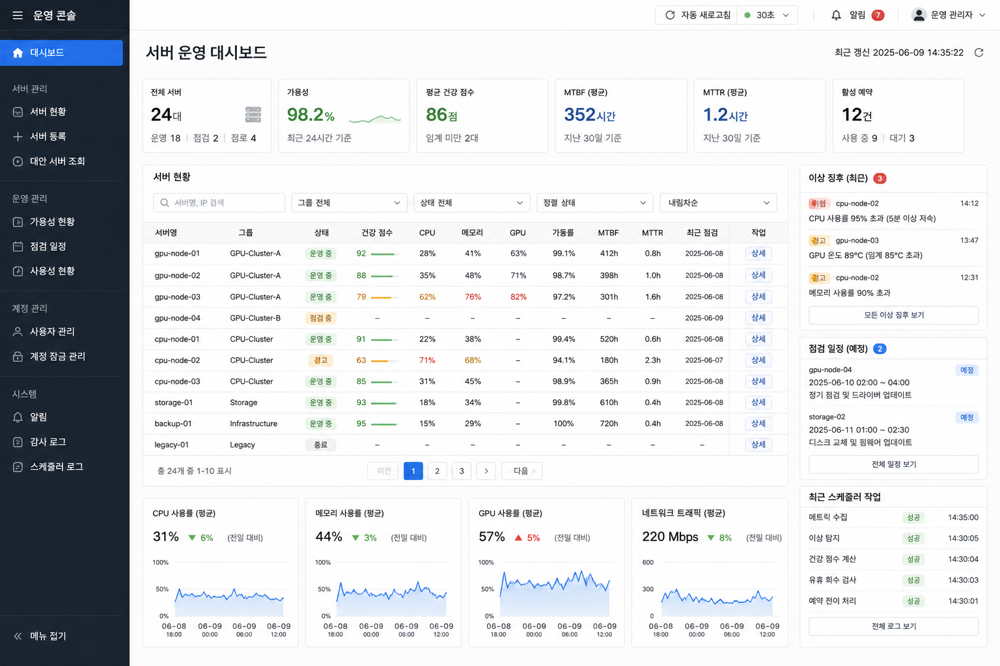

# 프론트엔드 화면 설계

프론트엔드가 구현해야 할 화면을 역할별(유저 STU / 팀 관리자 MGR / 서버 관리자 ADM)로 정의한다. 각 화면 카드의 미니 시안은 운영 콘솔 스타일 참조 디자인을 따른 레이아웃 스케치이며, 캡션에 그 화면에서 **할 수 있어야 하는 일**과 근거 UC를 적는다. 화면 간 이동 구조는 `frontend-design/frontend-ia.drawio` 참조.

> 참조 디자인 — 좌측 다크 내비, 상단 KPI 카드, 상태 뱃지 표, 우측 알림 패널, 하단 메트릭 차트:

## 공통 (비로그인)

  

    

    

      

      
<i></i><i></i><i class="btn"></i>

    

  

  
<b>C1. 로그인</b>이메일·비밀번호 입력, JWT 발급. 5회 실패 시 계정 일시 잠금 안내 표시. (UC23, UC20)

  

    

    

      

      
<i></i><i></i><i></i><i></i><i class="btn"></i>

    

  

  
<b>C2. 회원가입</b>이름·이메일·비밀번호·소속 팀 선택. 중복 이메일/팀 미존재 오류 안내. (UC22)

## 유저 (STU)

  

    

    

      

      

      

        

<i class="ok"></i><i class="info"></i><i class="warn"></i><i class="ok"></i>

        

<i></i><i class="warn"></i><i></i>

      

    

  

  
<b>S1. 대시보드</b>서버 풀 요약(가용/사용중/점검), 내 예약·Quota 잔여, 최근 알림. 한눈에 "지금 빌릴 수 있나"가 보여야 한다. (UC01·UC02·UC03·UC10)

  

    

    

      

      
<i class="ok"></i><i class="ok"></i><i class="warn"></i><i class="bad"></i><i class="info"></i><i class="ok"></i>

    

  

  
<b>S2. 서버 목록</b>상태(AVAILABLE/IN_USE/MAINTENANCE)·GPU 종류·현재 사용률로 필터/정렬. 행 클릭 시 상세로. (UC01)

  

    

    

      

      

        

        

<i class="ok"></i><i></i><i></i>

      

    

  

  
<b>S3. 서버 상세</b>CPU·MEM·GPU·NET 실시간 메트릭 차트(1분 주기), 90일 가동 이력, 헬스 점수, 예약 캘린더 미리보기. 여기서 바로 예약 버튼. (UC01·UC14·UC19)

  

    

    

      

      

        

<i></i><i></i><i class="busy"></i><i class="busy"></i><i></i><i class="sel"></i><i class="sel"></i><i class="sel"></i><i></i><i></i><i></i><i class="busy"></i><i></i><i></i>

        

<i></i><i></i><i class="btn"></i>

      

    

  

  
<b>S4. 예약 생성</b>기간 캘린더 선택(기존 예약 구간은 비활성), Quota 잔여 실시간 표시, 즉시 할당 버튼. Quota 초과 시 승인 요청 폼으로 전환. 충돌(409) 시 재시도 안내. (UC04·UC05·UC08)

  

    

    

      

      
<i class="info"></i><i class="warn"></i><i class="ok"></i><i class="bad"></i><i class="ok"></i>

    

  

  
<b>S5. 내 예약</b>예약 생애주기(RESERVED→IN_USE→RETURNED 등) 상태별 목록. 취소·반납 버튼, 만료 임박 경고, 빈 서버 없을 때 대기열 등록. (UC02·UC06·UC07)

  

    

    

      

      
<i></i><i class="ok"></i><i class="warn"></i><i></i><i class="bad"></i>

    

  

  
<b>S6. 알림 센터</b>승인 결과·회수·만료 알림을 WebSocket으로 실시간 수신, 읽음 처리. (UC03)

| 화면 | 핵심 기능 | UC |
|---|---|---|
| S1 대시보드 | 서버 풀·내 예약·Quota·알림 요약 | UC01 UC02 UC03 UC10 |
| S2 서버 목록 | 상태·사양 필터, 정렬, 상세 진입 | UC01 |
| S3 서버 상세 | 실시간 메트릭·가동 이력·헬스 점수 | UC01 UC14 UC19 |
| S4 예약 생성 | 캘린더 예약, 즉시 할당, 승인 요청 전환 | UC04 UC05 UC08 |
| S5 내 예약 | 취소·반납·대기열 등록 | UC02 UC06 UC07 |
| S6 알림 센터 | 실시간 알림 수신·읽음 처리 | UC03 |

## 팀 관리자 (MGR) — 유저 화면 전부 + 아래

  

    

    

      

      

        

<i class="warn"></i><i class="warn"></i><i></i><i></i>

        

<i></i><i class="btn"></i>

      

    

  

  
<b>M1. 승인 요청함</b>PENDING 요청 목록(요청자·서버·기간·사유), 승인/거절 결정. 72시간 경과 시 자동 거절됨을 표시. (UC09·UC17)

  

    

    

      

      

      
<i class="ok"></i><i class="ok"></i><i class="warn"></i><i class="ok"></i>

    

  

  
<b>M2. 팀 Quota 관리</b>팀 전체 한도 대비 팀원별 한도/사용량 표, 한도 조정. 초과 사용 경고. (UC10)

  

    

    

      

      

        

        

<i class="info"></i><i class="ok"></i><i class="warn"></i>

      

    

  

  
<b>M3. 팀 사용 현황</b>팀원별·기간별 서버 점유 차트, 팀 예약 전체 목록. 유휴 점유(낭비) 식별. (UC02·UC10)

| 화면 | 핵심 기능 | UC |
|---|---|---|
| M1 승인 요청함 | PENDING 승인/거절, 자동 거절 표시 | UC09 UC17 |
| M2 팀 Quota 관리 | 팀원별 한도 조회·조정 | UC10 |
| M3 팀 사용 현황 | 점유 차트·팀 예약 목록 | UC02 UC10 |

## 서버 관리자 (ADM) — 전체 화면 + 아래

사이드바 "서버 운영" 그룹에 6개 화면이 묶여 있다. 모든 운영 화면은 Grafana 스타일 라이트/다크 테마의 공통 시각화 라이브러리(`src/components/viz`)를 쓰며 약 3초 주기로 자동 갱신된다.

  

    

    

      

      

      

        

<i class="ok"></i><i class="warn"></i><i class="bad"></i><i class="ok"></i><i class="info"></i>

        

<i class="bad"></i><i class="warn"></i><i></i>

      

    

  

  
<b>A1. 운영 개요</b>가용 서버·평균 CPU/GPU·열린 인시던트·수집 성공률 KPI 5개, 플릿 테이블(위험 서버 우선 정렬, CPU/GPU/MEM 막대·헬스·위험 점수)과 GPU 사용률 히트맵 탭, 우측 활성 인시던트 패널(노이즈 감소율)과 스케줄러 최근 잡 패널. (UC14~UC19)

  

    

    

      

      

      

        

<i class="bad"></i><i class="warn"></i><i class="ok"></i><i class="ok"></i>

        

<i class="ok"></i><i class="warn"></i><i></i>

      

    

  

  
<b>가용성 현황</b>시스템 전체 가용성·누적 복구시간·평균 MTBF/MTTR KPI, SLA 목표선 충족 여부, 서버별 신뢰성 테이블(가용성 오름차순)과 상태 리본 탭. (UC21)

  

    

    

      

      

        

<i class="bad"></i><i class="warn"></i><i class="info"></i><i></i>

        

      

    

  

  
<b>A3. AIOps 모니터링</b>이상탐지(μ±2σ)를 묶은 인시던트 목록 → 선택하면 상관 타임라인, 대표 서버 메트릭 추세(임계선·이상 마커, 최근 6시간), LLM 근본 원인 카드. 상단에 노이즈 감소·열린 인시던트·탐지 방식·위험 서버 KPI. (UC18·UC22·UC24·UC25)

  

    

    

      

      

        

<i class="ok"></i><i class="ok"></i><i class="warn"></i><i class="ok"></i>

        

<i></i><i></i><i class="btn"></i>

      

    

  

  
<b>A2. 서버 관리</b>서버 등록·정보 수정, MAINTENANCE 전환(사용 중이면 강제 반납 경고), soft delete. 점검 일정 등록. (UC11·UC12·UC13)

  

    

    

      

      
<i></i><i class="btn"></i>

    

  

  
<b>계정 잠금 관리</b>5회 로그인 실패로 15분 일시 잠긴 계정의 오탐을 사용자 ID로 해제. (UC20)

  

    

    

      

      
<i></i><i></i><i></i><i class="bad"></i>

    

  

  
<b>고급 관리</b>데모·테스트용 운영 데이터 초기화 도구(가용성 히스토리·AIOps·알림/감사 로그·예약/승인/대기열·전체). 계정·팀·서버 마스터 데이터는 보존. 위험 작업은 2단계 확인.

| 화면 | 핵심 기능 | UC |
|---|---|---|
| A1 운영 개요 | KPI 5개·플릿 테이블/히트맵·인시던트·스케줄러 패널 | UC14 UC15 UC16 UC18 UC19 |
| 가용성 현황 | 시스템 가용성·MTBF/MTTR·SLA·신뢰성 테이블/리본 | UC21 |
| A3 AIOps 모니터링 | 인시던트 목록·상관 타임라인·메트릭 추세·LLM 근본 원인 | UC18 UC22 UC24 UC25 |
| A2 서버 관리 | 등록·수정·점검 전환·삭제·점검 일정 | UC11 UC12 UC13 |
| 계정 잠금 관리 | 잠긴 계정 잠금 해제 | UC20 |
| 고급 관리 | 운영 데이터 초기화(데모용) | — |

## 구현 우선순위 제안

| 순위 | 화면 | 이유 |
|---|---|---|
| 높음 | C1·C2, S2·S4·S5 | 핵심 흐름(로그인→탐색→예약→반납)이 끝까지 이어져야 시연 가능 |
| 중간 | S1·S6, M1·M2, A2·계정 잠금 | 역할별 차별점(승인·Quota·서버 관리)을 보여주는 화면 |
| 낮음 | S3, M3, A1·가용성·A3, 고급 | 차트·모니터링 — 백엔드 메트릭/AIOps API 안정화 이후 |
