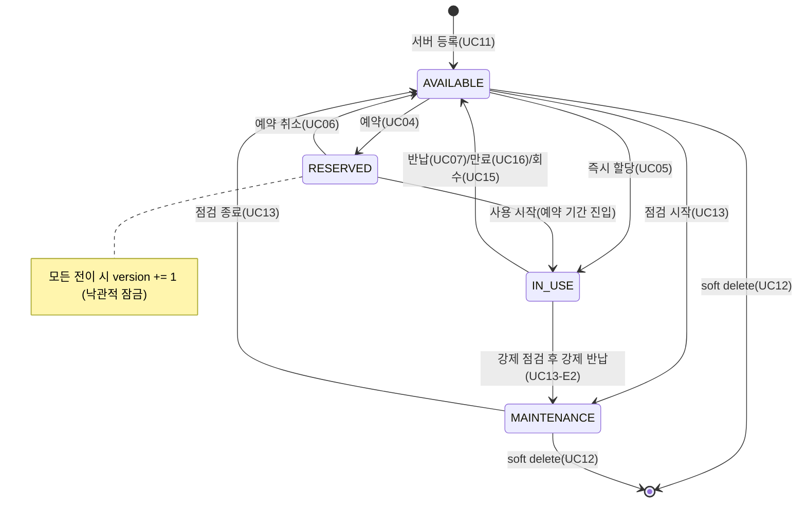
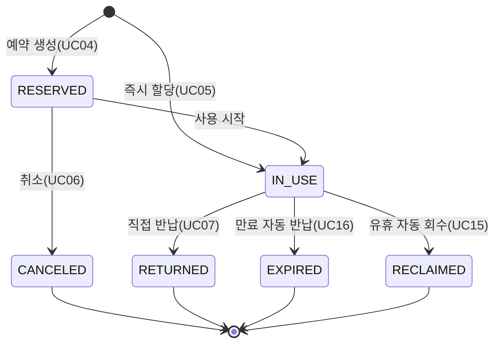
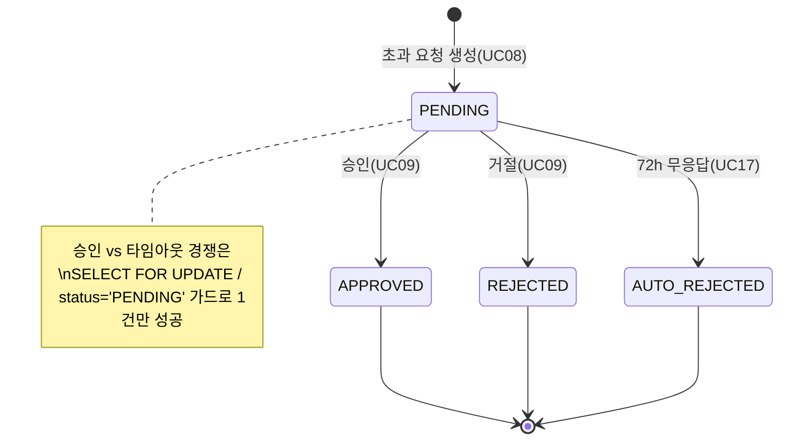
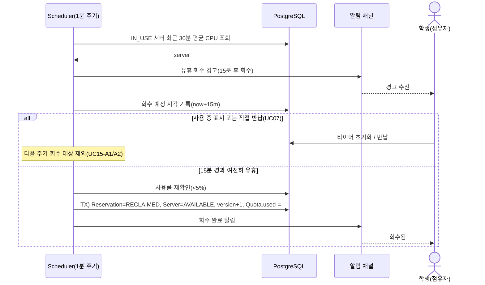

# 동적 모델 · 비기능 요구사항(NFR) — 보강 초안

> 작성 2026-05-29 · 검토용. `erd-feature-api-draft.md`(정적 모델·인터페이스)의 짝으로, 동적 모델과 NFR을 채워 SE 산출물 4분면(요구사항·정적·인터페이스·동적)을 닫는다.
> NFR은 **측정 가능 + 검증 방법**을 함께 적어 `test-plan-draft.md`의 입력이 되게 한다.

---

## 1. 상태 다이어그램

### 1.1 Server 상태



### 1.2 Reservation 상태



### 1.3 ApprovalRequest 상태



> 설계 발견 (확정 2026-05-29): RESERVED → IN_USE("사용 시작")는 **스케줄러 자동 전환**으로 결정. startTime 도달 시 주기 잡이 전환(UC16 만료 처리와 동일 1분 잡에 통합), 사용자 액션·엔드포인트 불필요. → 기능 카탈로그 F25에 책임 추가, ADR-05 참조.

---

## 2. 시퀀스 다이어그램

### 2.1 예약 낙관적 잠금 충돌 → 대안 서버 안내 (UC04 + UC03-d)

```mermaid
sequenceDiagram
    actor A as 학생 A
    actor B as 학생 B
    participant API as API(POST /reservations)
    participant DB as PostgreSQL
    participant WS as 알림 채널(WS)

    A->>API: 예약 {serverId:1, version:42}
    B->>API: 예약 {serverId:1, version:42}
    API->>DB: SELECT server#1 (status, version)
    DB-->>API: status=AVAILABLE, version=42
    Note over API,DB: 두 요청 모두 version=42를 읽음
    API->>DB: A) UPDATE server SET status=RESERVED, version=43 WHERE id=1 AND version=42
    DB-->>API: 1 row → 성공
    API->>DB: A) INSERT Reservation; Quota.used += ; COMMIT
    API-->>A: 201 예약 확정
    API->>DB: B) UPDATE ... WHERE id=1 AND version=42
    DB-->>API: 0 row → 충돌
    API->>DB: B) ROLLBACK
    API->>DB: B) 대안 서버 조회(AVAILABLE·유사 사양, ≤5)
    DB-->>API: [server#2, server#3]
    API-->>B: 409 + 대안 목록
    API->>WS: B에게 충돌 알림 푸시(UC03-d)
    WS-->>B: 모달: 대안 서버 선택 → UC04 재시도
```

### 2.2 승인 vs 타임아웃 경쟁 (UC09 / UC17)

```mermaid
sequenceDiagram
    actor M as 팀관리자(MGR)
    participant API as API(decision)
    participant SCH as Scheduler(UC17)
    participant DB as PostgreSQL

    Note over DB: ApprovalRequest#5 status=PENDING (72h 임박)
    par 동시 발생
        M->>API: 승인 {decision: APPROVE}
    and
        SCH->>SCH: 주기 도래, 72h 초과 탐지
    end
    API->>DB: BEGIN; SELECT req#5 FOR UPDATE
    SCH->>DB: UPDATE req#5 SET AUTO_REJECTED WHERE status='PENDING'
    Note over DB: 행 잠금 — 한쪽만 진행
    DB-->>API: 잠금 획득
    API->>DB: UPDATE status=APPROVED, decidedBy=MGR; COMMIT
    DB-->>SCH: 0 row (이미 PENDING 아님)
    SCH->>SCH: 처리 없이 종료(UC17-A1/E1)
    API-->>M: 200 승인 완료 → 예약 확정 재개
```

### 2.3 유휴 서버 감지·자동 회수 (UC15)



---

## 3. 비기능 요구사항 (NFR) — 테스트 가능 형태

> 목표 수치 **확정 2026-05-29**(학부 프로젝트 규모: 서버 ~100대, 동시 사용자 ~50명 기준). 구현·측정 단계에서 실측으로 재검증.
> 각 항목은 `test-plan-draft.md`의 테스트와 1:1 추적된다.

| ID | 범주 | 요구사항 (측정 가능) | 근거 | 검증 방법 |
|---|---|---|---|---|
| NFR-P1 | 성능 | 서버/예약 현황 조회 응답 p95 ≤ 300ms (서버 100대·동시 50명) | UC01·02 | 부하 테스트(k6/locust) |
| NFR-P2 | 성능 | 예약 생성(락·트랜잭션 포함) p95 ≤ 500ms | UC04 | 부하 + 동시성 테스트 |
| NFR-P3 | 성능 | 메트릭 1주기 수집(100대) ≤ 30s, 1분 주기 내 완료 | UC14 | 스케줄러 부하 테스트 |
| NFR-C1 | 동시성·신뢰성 | 동일 서버 동시 예약 시 이중 점유 **0건** | UC04 A.1 | 동시성 테스트(N스레드 경쟁) |
| NFR-C2 | 동시성 | 승인/타임아웃 경쟁 시 정확히 **1건만** 상태 전이 | UC09·17 | 동시성 테스트 |
| NFR-A1 | 가용성 | 시스템 가용성 목표 A ≥ 99% (부록 B 산식) | 부록 B | 가용성 산출·장애 주입 |
| NFR-A2 | 가용성 | 백엔드 5xx 시 조회 3회 재시도 + 캐시 폴백 | UC01 E3 | 장애 주입 테스트 |
| NFR-R1 | 신뢰성·일관성 | 상태 변경은 단일 트랜잭션 원자성(부분 반영 0) | UC04·15·16 | 통합 + 장애 주입 |
| NFR-R2 | 내구성·지속성 | 메트릭 저장 장애 시 버퍼→복구 재기록, 무손실(버퍼 한계 내) | UC14 E3 | 소크/내구성 테스트 |
| NFR-S1 | 보안 | RBAC(STU/MGR/ADM) 강제, 권한 위반 403 | 전반 | 인가 매트릭스 테스트 |
| NFR-S2 | 보안 | Rate limit 초과 시 15분 잠금, 잠금 중 429 | UC20 | 보안 + 부하 테스트 |
| NFR-S3 | 보안 | 수평 접근 제어 — 타팀 점유자 실명 비노출(팀코드) | UC01 E2 | 인가 테스트 |
| NFR-S4 | 감사성 | ADM·MGR 조회·삭제·잠금 이벤트 감사 로그 100% 기록 | 부록 A.6 | 로그 검증 테스트 |
| NFR-U1 | 사용성 | 알림 실시간 푸시 지연 ≤ 2s(WS), 현황 1분 자동 갱신 | UC03·01 | E2E 지연 측정 |
| NFR-Sc1 | 확장성 | 단일 노드 동시 사용자 ≥ 50 / 서버 ≥ 100 처리. 다중 인스턴스는 범위 외(Redis 분산락 준비) | 시스템 설계 | 중단점(capacity) 테스트 |
| NFR-M1 | 유지보수성 | api→core→infra 단방향 의존, 정적 분석(린트·타입) 통과 | 시스템 설계 | 정적 분석(ruff·mypy·import-linter) |

---

## 4. 설계 결정 기록 (ADR-lite)

| ID | 결정 | 대안 | 이유 |
|---|---|---|---|
| ADR-01 | 낙관적 잠금(version 컬럼) | 비관적 잠금(SELECT FOR UPDATE 전역) | 예약 충돌은 드묾 → 락 경합·데드락 위험 줄이고 처리량 확보. 승인 경쟁 등 좁은 구간만 비관적 락 병행 |
| ADR-02 | 서버 soft delete(deletedAt) | 물리 삭제 | 과거 메트릭·감사 로그 보존(UC12 E3, 부록) |
| ADR-03 | 상태 이력 테이블 미도입, SchedulerLog+status 근사 | ServerStatusHistory 도입 | 학기 범위 YAGNI. MTBF/MTTR 정확도 이슈 발생 시 도입 |
| ADR-04 | API/Scheduler 동일 코드베이스·별 프로세스 | 별도 서비스 분리 | core/infra 공유로 중복 제거, 단일 노드 단순성 |
| ADR-05 | RESERVED→IN_USE 전이는 **스케줄러 자동 전환**(확정) | 사용자 명시 액션 / 첫 접속 감지 | UC 미명시 공백을 상태도에서 발견·결정. startTime 잡에서 전환, UI 불필요 |
