# ERD · 기능 명세 · API 명세 — 통합 초안

> 작성 2026-05-29 · 최신화 2026-06-01(구현 반영) · 승인 후 노션(데이터 모델 페이지 + 기능/API 명세 DB)에 일괄 반영한다.
> 도출 근거: `use-case-spec.html`(UC01~UC21, 부록 A·B), `시스템 설계` 페이지(배치·아키텍처).

## 0. 설계 결정 요약 (합의됨)

- 기능 명세 / API 명세는 **별도 DB 2개 + relation 유지** (다대다·추적성).
- 기능 = **구현 단위(백엔드 서비스 메서드)**, **연산 단위 입도** (예: `예약 생성`·`예약 취소` 각각 하나).
- 도출 순서 **UC → ERD → 기능 → API**. API의 Request/Response는 ERD 엔티티를 참조한다.
- ERD는 **논리 수준**(엔티티 + 속성·타입 + 관계), SSOT는 **노션 "데이터 모델" 페이지**(mermaid erDiagram).
- 스케줄러 기능(UC14~UC19)·미들웨어 기능(UC20)은 **클라이언트 REST 엔드포인트가 없음** → "API 없는 기능"으로 기능 ≠ API 가 증명됨.

상태 의미: 기능 `미정의→정의완료(역할·입출력 합의+관련 API 연결)→구현완료(머지+테스트)` / API `미정의→정의완료(메서드·경로·Req/Res·에러 확정)→구현완료(라우터 구현+동작)`.

---

## 1. ERD (논리)

```mermaid
erDiagram
    Team ||--o{ User : "소속"
    Team ||--o{ Quota : "팀 한도 배분"
    User ||--|| Quota : "개인 한도"
    User ||--o{ Reservation : "예약"
    Server ||--o{ Reservation : "대상"
    User ||--o{ ApprovalRequest : "요청(requester)"
    User ||--o{ ApprovalRequest : "결재(approver)"
    Server ||--o{ ApprovalRequest : "대상 서버"
    User ||--o{ Notification : "수신"
    Server ||--o{ ServerMetric : "시계열 수집"
    Server ||--o{ AnomalyRecord : "이상 이력"
    Server ||--o{ MaintenanceSchedule : "점검 일정"
    Server ||--o{ QueueEntry : "대기열"
    User ||--o{ QueueEntry : "대기"
    User ||--o{ AuditLog : "행위자"

    Team {
        bigint id PK
        string name
        string code "타팀 표시용 코드(UC01-E2)"
        int totalQuotaLimit "팀 전체 한도(일수)"
        datetime createdAt
    }
    User {
        bigint id PK
        string name
        string email UK
        enum role "STU|MGR|ADM"
        bigint teamId FK
        string hashedPassword "nullable, JWT 인증 컬럼(후속 구현)"
        datetime lockedUntil "UC20 일시 잠금, nullable"
        datetime createdAt
    }
    Quota {
        bigint id PK
        bigint userId FK "1:1"
        bigint teamId FK
        int limit "개인 한도(일수)"
        int used "현재 점유량"
        int version "낙관적 잠금(UC10-E3)"
    }
    Server {
        bigint id PK
        string name
        string ip
        int cpuCores
        int ramGb
        string gpuModel "nullable"
        string groupName "서버 그룹, nullable"
        enum status "AVAILABLE|RESERVED|IN_USE|MAINTENANCE"
        int version "낙관적 잠금"
        int healthScore "UC19, nullable"
        datetime deletedAt "soft delete(UC12), nullable"
        datetime createdAt
    }
    Reservation {
        bigint id PK
        bigint userId FK
        bigint serverId FK
        datetime startTime
        datetime endTime
        enum status "RESERVED|IN_USE|CANCELED|RETURNED|EXPIRED|RECLAIMED"
        datetime createdAt
    }
    ApprovalRequest {
        bigint id PK
        bigint requesterId FK
        bigint approverId FK "팀 MGR, nullable"
        bigint serverId FK "대상 서버"
        datetime requestedStart
        datetime requestedEnd
        string reason
        enum status "PENDING|APPROVED|REJECTED|AUTO_REJECTED"
        datetime requestedAt
        datetime decidedAt "nullable"
        string decidedBy "userId 또는 SYSTEM, nullable"
    }
    Notification {
        bigint id PK
        bigint userId FK
        enum type "APPROVAL_RESULT|CONFLICT|IDLE_WARNING|EXPIRY|RECLAIM|SECURITY|..."
        string message
        json payload "링크·부가 데이터"
        datetime readAt "nullable"
        datetime createdAt
    }
    ServerMetric {
        bigint id PK
        bigint serverId FK
        float cpuUsage
        float memUsage
        float netUsage
        float gpuUsage "nullable, GPU 미탑재 시 null (서버풀 /metrics)"
        enum status "OK|MISSING|NA"
        datetime collectedAt "시계열 인덱스"
    }
    AnomalyRecord {
        bigint id PK
        bigint serverId FK
        float currentValue
        float mean "7일 이동평균 μ"
        float stddev "표준편차 σ"
        datetime detectedAt
    }
    MaintenanceSchedule {
        bigint id PK
        bigint serverId FK
        datetime startAt
        datetime endAt
        string reason
        string recurringRule "반복 점검(UC13-A2), nullable"
        bigint createdBy FK
        datetime createdAt
    }
    QueueEntry {
        bigint id PK
        bigint serverId FK "nullable(사양 기반 대기)"
        bigint userId FK
        json requestedSpec "사양 조건"
        int position
        datetime createdAt
    }
    SchedulerLog {
        bigint id PK
        string ucId "UC14~UC20"
        datetime executedAt
        bool success
        int processedCount
    }
    AuditLog {
        bigint id PK
        bigint actorId FK
        enum action "VIEW|DELETE_SERVER|ACCOUNT_LOCK|MANUAL_UNLOCK|..."
        string targetType
        string targetId
        json detail
        datetime createdAt
    }
```



설계 메모
- **낙관적 잠금**은 `Server.version`이 단일 진실. 예약/취소/반납/회수/만료는 모두 `WHERE id=? AND version=?` 조건으로 갱신, 영향 행 0이면 409 충돌(UC04-A.1).
- `Quota`는 `User`와 1:1이나 별도 엔티티로 둠(한도·사용량·version 독립 관리, UC10).
- `SchedulerLog`·`AuditLog`는 다른 엔티티와 FK 관계가 느슨(행위자/대상은 id 참조). UC21 대시보드와 가용성 지표(MTBF·MTTR)의 데이터 소스.
- 가용성 지표는 별도 테이블 없이 `SchedulerLog` + `Server.status` 이력에서 산출(부록 B.5). 상태 이력 추적이 필요하면 `ServerStatusHistory`를 추가 고려(미정).

설계 결정 (확정 2026-05-29)
- (Q1) `Reservation.version` **두지 않음** — 충돌 제어는 `Server.version` 단일 진실로 충분. 예약 행 자체의 동시 수정 경로 없음.
- (Q2) 대기열은 `QueueEntry` **엔티티로 유지** — UC05 "대기 N번째"(position)·반납 시 자동 할당 트리거에 필요.
- (Q3) `ServerStatusHistory` **생략** — UC21 MTBF/MTTR은 `SchedulerLog` + `Server.status`로 근사. 대시보드 정확도 이슈 발생 시 추가(설계 결정 ADR-03 참조).

---

## 2. 기능 카탈로그 (연산 단위, 30개)

> 담당자는 팀 배정 전이라 (미정). 우선순위는 UC 명세 그대로.

| # | 기능 이름 | 도메인 | 관련 UC | 우선순위 | 관련 API | 비고 |
|---|---|---|---|---|---|---|
| F01 | 서버 현황 조회 | 조회 | UC01 | 중간 | GET /servers | 권한별 범위·필터·정렬·1분 새로고침 |
| F02 | 서버 상세 조회 | 조회 | UC01 | 낮음 | GET /servers/{id} | 단건 상세 |
| F03 | 예약 현황 조회 | 조회 | UC02 | 중간 | GET /reservations | 권한별 범위·상태/기간 필터 |
| F04 | 서버 예약 요청(예약형) | 예약·할당 | UC04 | 높음 | POST /reservations | 낙관적 잠금, Quota 검사 |
| F05 | 즉시 서버 요청 | 예약·할당 | UC05 | 중간 | POST /reservations/instant | 조건 매칭 1대 즉시 IN_USE, 없으면 대기열 |
| F06 | 예약 취소 | 예약·할당 | UC06 | 중간 | POST /reservations/{id}/cancel | RESERVED 한정, Quota 회복 |
| F07 | 서버 반납 | 예약·할당 | UC07 | 중간 | POST /reservations/{id}/return | IN_USE 한정, 조기 반납 |
| F08 | 대안 서버 조회 | 예약·할당 | UC03-d | 높음 | GET /servers/alternatives | 충돌 시 유사 사양 최대 5건 |
| F09 | Quota 초과 승인 요청 생성 | 승인·Quota | UC08(UC04/05 확장) | 높음 | POST /approval-requests | PENDING 생성 |
| F10 | 허가함 목록 조회 | 승인·Quota | UC09 | 높음 | GET /approval-requests | MGR 결재 대기 목록 |
| F11 | 초과 요청 승인/거절 | 승인·Quota | UC09 | 높음 | POST /approval-requests/{id}/decision | 부분 승인·대리 허가 |
| F12 | 팀원별 Quota 조회 | 승인·Quota | UC10 | 중간 | GET /teams/{id}/quotas | 한도·사용량 |
| F13 | 팀원별 Quota 설정 | 승인·Quota | UC10 | 중간 | PATCH /quotas/{id} | 합계 검증, 낙관적 잠금 |
| F14 | 서버 등록 | 서버관리 | UC11 | 중간 | POST /servers | 검증, version=1 |
| F15 | 서버 삭제 | 서버관리 | UC12 | 낮음 | DELETE /servers/{id} | soft delete, 활성예약 차단 |
| F16 | 점검 스케줄 등록 | 서버관리 | UC13 | 중간 | POST /servers/{id}/maintenances | 충돌 검사·반복·강제 |
| F17 | 알림 목록 조회 | 알림 | UC03-a | 높음 | GET /notifications | 알림함 |
| F18 | 알림 읽음 처리 | 알림 | UC03-a | 중간 | PATCH /notifications/{id}/read | readAt 기록 |
| F19 | 실시간 알림 채널 | 알림 | UC03-a, UC03-d | 높음 | WS /ws/notifications | 배지·충돌 모달 푸시 |
| F20 | 계정 잠금 해제(수동) | 보안·운영 | UC20 | 중간 | POST /admin/users/{id}/unlock | ADM 오탐 해제 |
| F21 | 운영 대시보드 조회 | 보안·운영 | UC21 | 중간 | GET /ops/dashboard | 5개 섹션 집계 |
| F22 | 가용성 현황 조회 | 보안·운영 | UC21 | 중간 | GET /ops/availability | 업타임·MTBF·MTTR·A% |
| F23 | 실시간 사용률 수집 | 모니터링·자동화 | UC14 | 중간 | — (스케줄러 1분) | 서버풀 /metrics PULL |
| F24 | 유휴 서버 감지·자동 회수 | 모니터링·자동화 | UC15 | 높음 | — (스케줄러 1분) | 경고 후 15분 회수 |
| F25 | 예약 만료 자동 반납·사용 시작 전환 | 모니터링·자동화 | UC16 | 높음 | — (스케줄러 1분) | 만료 예약 EXPIRED + startTime 도달 시 RESERVED→IN_USE(ADR-05) |
| F26 | 승인 타임아웃 자동 거절 | 모니터링·자동화 | UC17 | 중간 | — (스케줄러) | 72h PENDING→AUTO_REJECTED |
| F27 | 서버 이상 징후 탐지 | 모니터링·자동화 | UC18 | 높음 | — (스케줄러 5분) | μ±2σ, AnomalyRecord |
| F28 | 서버 건강 점수 산출 | 모니터링·자동화 | UC19 | 중간 | — (스케줄러 10분) | 가중 평균 healthScore |
| F29 | 비정상 접근 감지·일시 잠금 | 보안·운영 | UC20 | 높음 | — (미들웨어) | Rate limit, 15분 잠금 |
| F30 | 점검 스케줄 자동 상태 전환 | 모니터링·자동화 | UC13 | 중간 | — (스케줄러) | 시작/종료 시 MAINTENANCE↔AVAILABLE |

스케줄러/미들웨어 기능(F23~F29, F30): 클라이언트 호출 API 없음. 단, 동작 결과는 `SchedulerLog`에 기록되어 F21 대시보드(GET /ops/dashboard)에서 노출됨.

---

## 3. API 카탈로그 (22개 엔드포인트)

> 모든 엔드포인트는 인증 필요(미인증 401). 권한 불일치 403. 잠금 상태 사용자 429(UC20).
> Request/Response는 핵심 필드만. path/query 파라미터는 Request에 표기.

### 조회

**GET /servers** · 통신 REST · 권한 STU/MGR/ADM · 기능 F01
```jsonc
// Request (query)
{ "status": "AVAILABLE", "group": "Lab-A GPU", "sort": "name", "order": "asc" }
// Response 200
{ "servers": [ { "id": 1, "name": "gpu-01", "status": "AVAILABLE",
  "spec": {"cpuCores":16,"ramGb":64,"gpuModel":"RTX4090"},
  "healthScore": 82, "occupant": "팀코드 또는 실명(권한별)" } ] }
```
에러: 401, 403, 404(표시할 서버 없음 UC01-E1), 500

**GET /servers/{id}** · REST · STU/MGR/ADM · F02 — 단건 상세. 에러 401,403,404,500

**GET /reservations** · REST · STU(본인)/MGR(팀)/ADM(전체) · F03
```jsonc
// Request (query): { "scope":"mine", "status":"active", "from":"...", "to":"..." }
// Response 200: { "reservations":[ {"id":10,"serverId":1,"serverName":"gpu-01",
//   "startTime":"...","endTime":"...","status":"RESERVED"} ] }
```
에러: 401, 403(타인 예약 조회 UC02-E1), 500

**GET /servers/alternatives** · REST · STU · F08
```jsonc
// Request (query): { "serverId": 1 }
// Response 200: { "alternatives": [ {"id":2,"name":"gpu-02","spec":{...}} ] }  // 최대 5
```
에러: 401, 500

### 예약·할당

**POST /reservations** · REST · STU · F04
```jsonc
// Request: { "serverId": 1, "startTime": "2026-06-01T09:00", "endTime": "2026-06-03T09:00", "version": 42 }
// Response 201: { "reservationId": 10, "status": "RESERVED", "server": {...} }
```
에러: 400, 401, 403, 409(낙관적 잠금 충돌 UC04-E1 → UC03-d), 422(Quota 초과 → 승인 분기 UC04-A1), 500

**POST /reservations/instant** · REST · STU · F05
```jsonc
// Request: { "spec": {"minRamGb":32,"gpuRequired":true} }
// Response 201: { "reservationId": 11, "status": "IN_USE", "server": {"ip":"10.0.0.5",...} }
// Response 202(대기열): { "queued": true, "position": 3 }
```
에러: 400, 401, 409, 422(Quota 초과), 500

**POST /reservations/{id}/cancel** · REST · STU(소유자) · F06 — 에러 401,403(타인 UC06-E2),404,409(상태/충돌 UC06-E1·E3),500

**POST /reservations/{id}/return** · REST · STU(소유자) · F07 — 에러 401,403(타인 UC07-E2),404,409(이미 종료/회수 경합 UC07-E1·E3),500

### 승인·Quota

**POST /approval-requests** · REST · STU · F09
```jsonc
// Request: { "serverId":1, "startTime":"...", "endTime":"...", "reason":"논문 실험" }
// Response 201: { "approvalRequestId": 5, "status": "PENDING" }
```
에러: 400, 401, 409, 500

**GET /approval-requests** · REST · MGR/ADM · F10
```jsonc
// Request (query): { "status": "PENDING" }
// Response 200: { "requests":[ {"id":5,"requester":"홍길동","serverName":"gpu-01",
//   "period":"...","reason":"...","teamUsage":"7/10","requestedAt":"..."} ] }
```
에러: 401, 403, 500

**POST /approval-requests/{id}/decision** · REST · MGR/ADM(대리) · F11
```jsonc
// Request: { "decision": "APPROVE", "shortenedEnd": "2026-06-02T09:00" }   // 부분 승인 옵션
//      또는 { "decision": "REJECT", "reason": "한도 초과" }                  // 거절 사유 필수
// Response 200: { "id":5, "status":"APPROVED", "reservationId": 12, "decidedAt":"...", "decidedBy": 3 }
```
에러: 400, 401, 403(타팀 UC09-E3), 404, 409(타임아웃 경합 UC09-E2 / 서버 점유 UC09-E1), 500

**GET /teams/{id}/quotas** · REST · MGR/ADM · F12
```jsonc
// Response 200: { "members":[ {"userId":4,"name":"홍길동","limit":3,"used":1} ], "teamLimit":10 }
```
에러: 401, 403, 404, 500

**PATCH /quotas/{id}** · REST · MGR/ADM · F13
```jsonc
// Request: { "limit": 5, "version": 7 }
// Response 200: { "id":2, "limit":5, "used":1, "version":8 }
```
에러: 400(합계 초과 UC10-E1 / 사용량 미만 UC10-E2), 401, 403, 409(동시 수정 UC10-E3), 500

### 서버관리

**POST /servers** · REST · ADM · F14
```jsonc
// Request: { "name":"gpu-03", "ip":"10.0.0.7", "cpuCores":16, "ramGb":64,
//   "gpuModel":"RTX4090", "group":"Lab-A GPU", "startInMaintenance": false }
// Response 201: { "id":3, "status":"AVAILABLE", "version":1 }
```
에러: 400, 401, 403, 409(IP 중복), 422(필수 누락 UC11-E1), 500

**DELETE /servers/{id}** · REST · ADM · F15 — soft delete(deletedAt). 에러 401,403,404,409(활성 예약 UC12-E1),500

**POST /servers/{id}/maintenances** · REST · ADM · F16
```jsonc
// Request: { "startAt":"...", "endAt":"...", "reason":"디스크 교체",
//   "recurringRule": null, "force": false }
// Response 201: { "maintenanceId": 8 }
```
에러: 400(잘못된 기간 UC13-E3), 401, 403, 404, 409(예약 충돌 UC13-E1·E2 / 중복 UC13-E4), 500

### 알림

**GET /notifications** · REST · 인증 사용자 · F17 — 에러 401,500
**PATCH /notifications/{id}/read** · REST · 소유자 · F18 — 에러 401,403,404,500
**WS /ws/notifications** · WebSocket · 인증 사용자 · F19, F08 — 알림 배지·예약 충돌 모달(UC03-d) 실시간 푸시. 에러 401

### 보안·운영

**POST /admin/users/{id}/unlock** · REST · ADM · F20 — 잠금 해제(오탐). 에러 401,403,404,500

**GET /ops/dashboard** · REST · ADM · F21
```jsonc
// Response 200: { "scheduler":[{"ucId":"UC15","lastRun":"...","success":true,"processed":3}],
//   "metrics":{"successRate":0.98,"missing":["gpu-09"]},
//   "autoActions":{"reclaimed":2,"expired":5,"autoRejected":1},
//   "health":{"정상":12,"주의":3,"위험":1} }
```
에러: 401, 403(STU/MGR UC21-E2), 500

**GET /ops/availability** · REST · ADM · F22
```jsonc
// Response 200: { "servers":[{"id":1,"uptime":99.2,"mtbf":120.5,"mttr":0.8,"riskBadge":false}],
//   "systemAvailability": 99.1 }
```
에러: 401, 403, 500 (데이터 부족 시 N/A UC21-E3)

---

## 4. 추적 매핑 (UC → 기능 → API)

| UC | 기능 | API |
|---|---|---|
| UC01 | F01, F02 | GET /servers, GET /servers/{id} |
| UC02 | F03 | GET /reservations |
| UC03-a | F17, F18, F19 | GET /notifications, PATCH /notifications/{id}/read, WS |
| UC03-d | F08, F19 | GET /servers/alternatives, WS |
| UC04 | F04 | POST /reservations |
| UC05 | F05 | POST /reservations/instant |
| UC06 | F06 | POST /reservations/{id}/cancel |
| UC07 | F07 | POST /reservations/{id}/return |
| UC08 | F09 | POST /approval-requests |
| UC09 | F10, F11 | GET /approval-requests, POST /approval-requests/{id}/decision |
| UC10 | F12, F13 | GET /teams/{id}/quotas, PATCH /quotas/{id} |
| UC11 | F14 | POST /servers |
| UC12 | F15 | DELETE /servers/{id} |
| UC13 | F16, F30 | POST /servers/{id}/maintenances |
| UC14 | F23 | — |
| UC15 | F24 | — |
| UC16 | F25 | — |
| UC17 | F26 | — |
| UC18 | F27 | — |
| UC19 | F28 | — |
| UC20 | F29, F20 | POST /admin/users/{id}/unlock |
| UC21 | F21, F22 | GET /ops/dashboard, GET /ops/availability |

---

## 5. 노션 반영 계획 (승인 후 실행)

1. **기능 명세 진척도 DB** 컬럼 추가: `도메인`(select), `우선순위`(select).
2. **API 명세 진척도 DB** 컬럼 추가: `메서드`(select), `경로`(text), `통신 유형`(select), `권한`(multi-select). 제목은 `METHOD /path` 규칙.
3. **데이터 모델 페이지** 신규 생성(서버 예약/할당 관리 시스템 하위): 위 mermaid erDiagram + 엔티티별 속성표.
4. 기능 30건 · API 22건 행 생성, `관련 API`↔`관련 기능` relation 연결, `관련 UC`·`우선순위`·`도메인` 채움. 담당자는 미배정.
